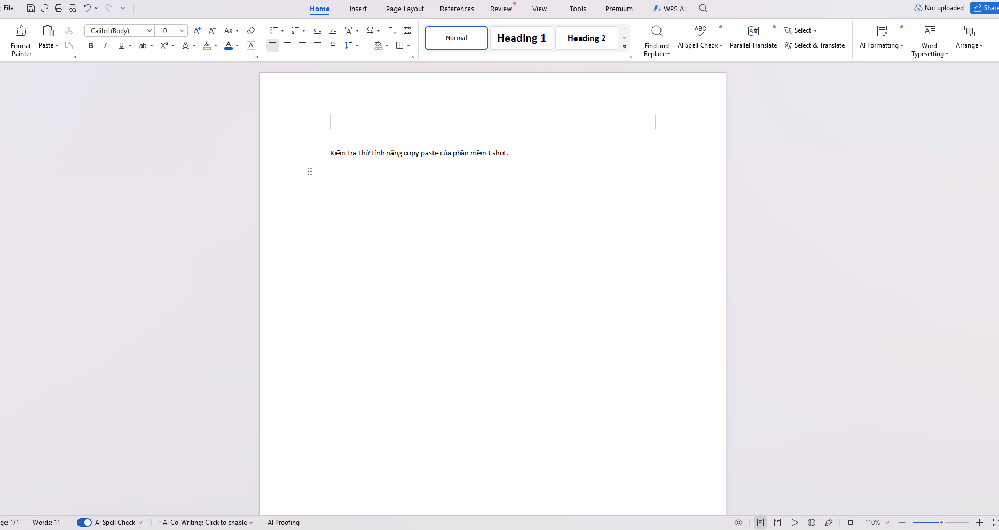

# FShot — Công cụ chụp & chú thích màn hình cho Windows



> **FShot** là công cụ chụp màn hình và chú thích trực tiếp, được viết lại từ đầu cho Windows bằng **F# + Avalonia + SkiaSharp**. Mục tiêu mang lại trải nghiệm gần gũi với Flameshot nhưng nhẹ nhàng, dễ build và dễ mở rộng trên hệ sinh thái .NET.

---

## Vì sao lại có FShot?

Tôi thích dùng [Flameshot](https://flameshot.org). Nhưng mỗi khi muốn đóng góp hoặc tự build nó trên Windows, bộ công cụ phát triển (MSYS2, Qt, v.v.) khiến máy trở nên nặng nề và quá phức tạp so với nhu cầu thực tế.

Vì vậy, tôi quyết định làm lại một công cụ tương tự bằng stack quen thuộc hơn:

- **F#** — ngôn ngữ chủ đạo cho domain model, immutable records, discriminated unions và pattern matching rõ ràng.
- **Avalonia UI 11** — UI desktop cross-platform, hỗ trợ cửa sổ borderless/topmost và render Skia.
- **SkiaSharp** — vẽ 2D hiệu năng cao, quản lý pixel chính xác.
- **Windows.Graphics.Capture** — chụp màn hình hiện đại, xử lý đúng Mixed DPI và đa màn hình.

Dự án được phát triển với sự giúp đỡ của hai dev AI chuyên nghiệp: **kimi-k2.7** và **Google Gemini**.  
(Tôi không thuê Claude vì anh ta hơi... ảo tưởng về giá.)

---

## Tính năng hiện có

- ✅ Chụp toàn màn hình hoặc một vùng tùy chọn qua overlay tương tác.
- ✅ Phủ tối vùng ngoài lựa chọn, giữ nguyên ảnh desktop bên dưới.
- ✅ Vùng chọn có 8 điểm neo, hỗ trợ kéo di chuyển, resize, nudge 1 px bằng phím mũi tên.
- ✅ Công cụ chú thích: Pencil, Line, Arrow, Rectangle, Circle, Marker, Text, Pixelate.
- ✅ Undo / Redo (`Ctrl+Z` / `Ctrl+Shift+Z`).
- ✅ Lưu file (`Ctrl+S`) với Save As dialog và tự động đóng overlay.
- ✅ Copy vào clipboard Windows định dạng kép `CF_DIB + PNG`, giữ alpha channel cho app như Zalo/Telegram/Discord/Chrome.
- ✅ Xử lý Mixed DPI & High-DPI trên đa màn hình.

### Đang phát triển

- 🚧 CLI parser (`fshot gui`, `fshot full`, `fshot screen`).
- 🚧 System tray, global hotkey `Win+Shift+X`, khởi động cùng Windows.
- 🚧 Config UI, Pin widget, Magnifier/Eyedropper.
- 🚧 Imgur upload, snap-to-grid, i18n.

---

## Kiến trúc

```text
FShot/
├── src/
│   ├── FShot.Core/            (F# thuần — geometry, domain, state, history, export)
│   ├── FShot.Rendering.Skia/  (bridge vẽ SkiaSharp, phụ thuộc FShot.Core)
│   ├── FShot.Platform.Win32/  (capture, hotkey, clipboard, file dialog, registry)
│   └── FShot.UI/              (Avalonia app, overlay window, custom Skia canvas)
└── tests/                     (xUnit + FsUnit cho domain và render)
```

Nguyên tắc thiết kế:

- `FShot.Core` không phụ thuộc UI hay platform API.
- Mọi thao tác hình học và undo là pure function trên immutable data.
- Rendering dùng backing bitmap, không sinh nhiều `Shape` Avalonia cho từng nét vẽ.
- Platform-specific được cô lập để sau này dễ mở rộng Linux/macOS.

---

## Yêu cầu

- Windows 10 1903+ hoặc Windows 11
- [.NET 8 SDK](https://dotnet.microsoft.com/download/dotnet/8.0)

## Build & Chạy

```bash
# Build toàn bộ solution
dotnet build FShot.sln

# Chạy tests
dotnet test

# Chạy ứng dụng
dotnet run --project src/FShot.UI
```

---

## Giấy phép

Dự án được phát hành dưới giấy phép [MIT](LICENSE).

Copyright (c) 2026 LMO

---

## Lời cảm ơn

Cảm ơn **kimi-k2.7** và **Google Gemini** đã đồng hành thiết kế kiến trúc, triển khai tính năng và debug những vấn đề tinh vi như clipboard lifecycle trên Windows.  
Cảm ơn cộng đồng Flameshot vì đã tạo ra một công cụ tuyệt vời để chúng ta có cảm hứng làm lại nó theo cách của riêng mình.
