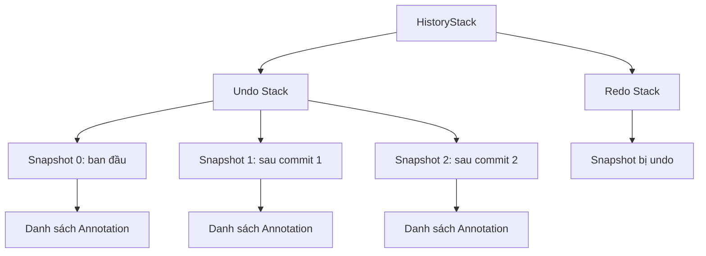

# Snapshot — Thiết kế chi tiết

> Tài liệu này định nghĩa đơn vị lưu trữ trạng thái của overlay tại một thời điểm nhất định, phục vụ cho hoàn tác và làm lại.

---

## 1. Mục đích

`Snapshot` là một bản ghi cố định của toàn bộ trạng thái có thể thay đổi trong một phiên chụp. Khi người dùng thực hiện một thao tác, hệ thống không sửa đổi trạng thái cũ mà tạo ra một snapshot mới. Snapshot mới này trở thành trạng thái hiện tại và được đưa vào lịch sử.

Mục tiêu của snapshot là biến mọi thay đổi thành một giá trị bất biến, từ đó hỗ trợ undo/redo an toàn và dễ dàng kiểm thử.

---

## 2. Cấu trúc dữ liệu tổng quan

Snapshot là thành phần nhỏ nhất trong hệ thống lịch sử. Nó được chứa bên trong `HistoryStack`, gồm có hai nhánh: undo stack và redo stack. Mối quan hệ này được minh họa như sau:

Trong đó, mỗi `Snapshot` chứa một danh sách Annotation. Undo stack lưu các snapshot theo thứ tự thời gian. Redo stack lưu các snapshot đã bị undo. Snapshot ở đỉnh undo stack là trạng thái hiện tại.

---

## 2. Thành phần của Snapshot

### 2.1 Danh sách chú thích

Thành phần chính của snapshot là danh sách các Annotation đã được commit. Danh sách này đại diện cho mọi nét vẽ, hình học, văn bản, và vùng pixelate đang hiển thị trên ảnh.

Ví dụ, sau khi người dùng vẽ một đường Line, snapshot sẽ chứa một Annotation dạng Line. Sau khi vẽ thêm một mũi tên Arrow, snapshot mới sẽ chứa cả Line và Arrow.

### 2.2 Vùng chọn

Trong một số chế độ, snapshot cũng lưu trạng thái của vùng chọn, bao gồm vị trí, kích thước, và trạng thái tương tác. Tuy nhiên, trong MVP, việc di chuyển hoặc thay đổi kích thước vùng chọn không tạo snapshot mới. Chỉ các thao tác làm thay đổi danh sách chú thích mới kích hoạt snapshot.

Ví dụ, người dùng kéo vùng chọn từ vị trí A sang B: vùng chọn thay đổi nhưng chưa có snapshot mới. Khi người dùng vẽ một nét Pencil lên vùng chọn đã di chuyển, snapshot mới được tạo và vùng chọn lúc đó được lưu kèm.

### 2.3 Công cụ và style hiện tại

Trong v1.x, snapshot có thể mở rộng để lưu công cụ đang chọn, màu sắc hiện tại, độ dày nét, và các thuộc tính style khác. Điều này cho phép khôi phục toàn bộ trạng thái làm việc của người dùng sau khi undo/redo.

Trong MVP, thông tin công cụ và style không bắt buộc phải lưu trong snapshot. UI layer có thể giữ trạng thái này riêng. Nếu sau này cần khôi phục chính xác công cụ đã dùng, thì thông tin đó sẽ được thêm vào snapshot.

---

## 3. Tính bất biến

Snapshot được thiết kế theo hướng bất biến. Một khi snapshot được tạo, không có trường nào bên trong nó bị thay đổi. Khi cần một trạng thái mới, hệ thống tạo snapshot khác thay vì sửa đổi snapshot hiện tại.

Tính bất biến đảm bảo rằng mỗi bước trong lịch sử là độc lập. Khi undo, hệ thống chỉ cần lấy snapshot cũ ra dùng lại. Không cần tính toán ngược các thay đổi đã xảy ra.

### 3.1 Tại sao phải bất biến

Nếu snapshot thay đổi được, khi undo quay lại một snapshot cũ, nội dung của snapshot cũ có thể đã bị ảnh hưởng bởi các thao tác sau. Điều này làm cho undo không an toàn và kết quả render có thể sai lệch.

Ví dụ, giả sử snapshot S1 chứa một Line. Sau đó người dùng vẽ Arrow và tạo snapshot S2. Nếu S1 có thể thay đổi, một lỗi trong logic có thể làm Arrow xuất hiện trong S1. Khi undo về S1, Line sẽ hiển thị kèm theo Arrow dù lúc đó chưa vẽ Arrow.

### 3.2 Cách đảm bảo bất biến

Mọi thao tác tạo snapshot đều tạo ra danh sách Annotation mới. Thay vì thêm Annotation vào danh sách hiện tại, hệ thống tạo một danh sách khác chứa các Annotation cũ cộng Annotation mới. Danh sách cũ vẫn giữ nguyên và thuộc về snapshot cũ.

Ví dụ, snapshot hiện tại có danh sách [A1, A2]. Người dùng vẽ A3. Hệ thống tạo danh sách mới [A1, A2, A3] và gói vào snapshot mới. Snapshot cũ vẫn giữ [A1, A2].

---

## 4. Cách tạo Snapshot

### 4.1 Từ trạng thái ban đầu

Khi overlay mở lần đầu, một snapshot ban đầu được tạo với danh sách chú thích rỗng. Snapshot này là điểm xuất phát của lịch sử.

Ví dụ, người dùng nhấn `Ctrl + Shift + S` để mở overlay. Hệ thống chụp màn hình, tạo snapshot rỗng, và đẩy vào HistoryStack.

### 4.2 Từ thao tác commit

Khi một thao tác vẽ hoàn tất, hệ thống lấy danh sách chú thích hiện tại, thêm Annotation mới vào cuối, rồi gói danh sách mới thành snapshot.

Ví dụ, người dùng vẽ Line từ (100, 100) đến (400, 250) và thả chuột. Hệ thống tạo Annotation Line, thêm vào danh sách cũ, tạo snapshot mới, và đẩy vào HistoryStack.

### 4.3 Từ thao tác xóa

Khi một Annotation bị xóa, hệ thống tạo danh sách mới chứa tất cả Annotation cũ trừ Annotation bị xóa. Danh sách mới này trở thành snapshot mới.

Ví dụ, snapshot hiện tại có ba Annotation: Line, Arrow, Rectangle. Người dùng xóa Arrow. Snapshot mới chỉ chứa Line và Rectangle.

### 4.4 Từ thao tác thay đổi thứ tự layer

Trong v1.x, khi người dùng di chuyển một Annotation lên trên hoặc xuống dưới, danh sách Annotation được sắp xếp lại. Snapshot mới chứa danh sách đã sắp xếp.

Ví dụ, danh sách hiện tại là [A1, A2, A3]. Người dùng đưa A3 lên trên A1. Danh sách mới là [A3, A1, A2]. Snapshot mới chứa danh sách này.

Trong MVP, thao tác này chưa được hỗ trợ.

---

## 5. So sánh và đồng nhất

### 5.1 Snapshot có thể giống nhau

Hai snapshot khác nhau về mặt định danh có thể có nội dung giống nhau. Ví dụ, nếu người dùng undo một thao tác rồi redo lại, snapshot cuối cùng có nội dung giống snapshot trước khi undo, nhưng nó vẫn là một snapshot riêng biệt trong lịch sử.

### 5.2 Không chia sẻ cấu trúc bên trong

Mỗi snapshot sở hữu một danh sách Annotation riêng. Ngay cả khi hai snapshot liên tiếp chỉ khác nhau bởi một Annotation, danh sách trong snapshot mới vẫn là một bản sao độc lập. Điều này tránh rủi ro một phần của snapshot bị sửa đổi từ bên ngoài.

Ví dụ, snapshot A chứa Annotation 1 và 2. Snapshot B chứa Annotation 1, 2, và 3. Dù Annotation 1 và 2 xuất hiện trong cả hai snapshot, chúng là cùng một giá trị bất biến nên việc dùng chung là an toàn. Tuy nhiên, danh sách chứa chúng trong snapshot A và B là hai danh sách khác nhau.

### 5.3 Không so sánh nội dung khi Push

Trong MVP, hệ thống không kiểm tra xem snapshot mới có giống snapshot hiện tại hay không. Mỗi lần Push đều tạo ra một snapshot mới. Điều này đơn giản hóa logic và tránh bỏ sót các thao tác có ý nghĩa.

Ví dụ, nếu người dùng vẽ một nét Pencil rất ngắn, gần như không thay đổi gì so với snapshot cũ, hệ thống vẫn Push snapshot mới. Khi undo, nét Pencil đó sẽ bị xóa.

---

## 6. Phạm vi trong MVP

Trong MVP, snapshot chỉ cần lưu danh sách Annotation. Các thông tin khác như vùng chọn, công cụ đang chọn, hoặc trạng thái preview không cần lưu trong snapshot.

Nếu cần lưu thêm thông tin trong tương lai, snapshot có thể mở rộng mà không làm thay đổi cấu trúc cơ bản của HistoryStack.

---

## 7. Kết nối với các phần khác

- **Annotation:** là nội dung chính bên trong snapshot.
- **HistoryStack:** lưu trữ và quản lý các snapshot theo thứ tự thời gian.
- **Overlay State Machine:** gọi tạo snapshot khi có thao tác cần lưu lịch sử.
- **Config:** cung cấp giới hạn số snapshot trong lịch sử.

---

*Snapshot là đơn vị cơ bản của History. Tiếp theo, `05_03_HistoryStack.md` sẽ định nghĩa cách tổ chức và thao tác trên danh sách snapshot.*
