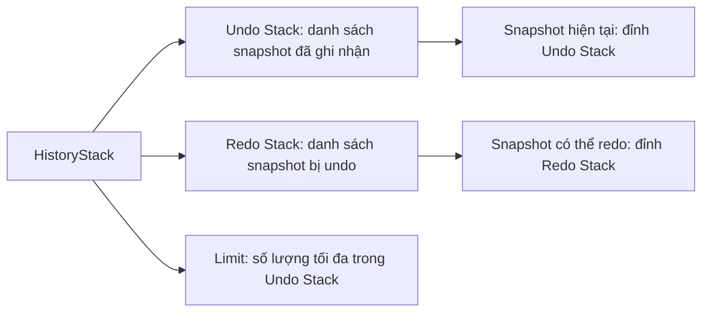
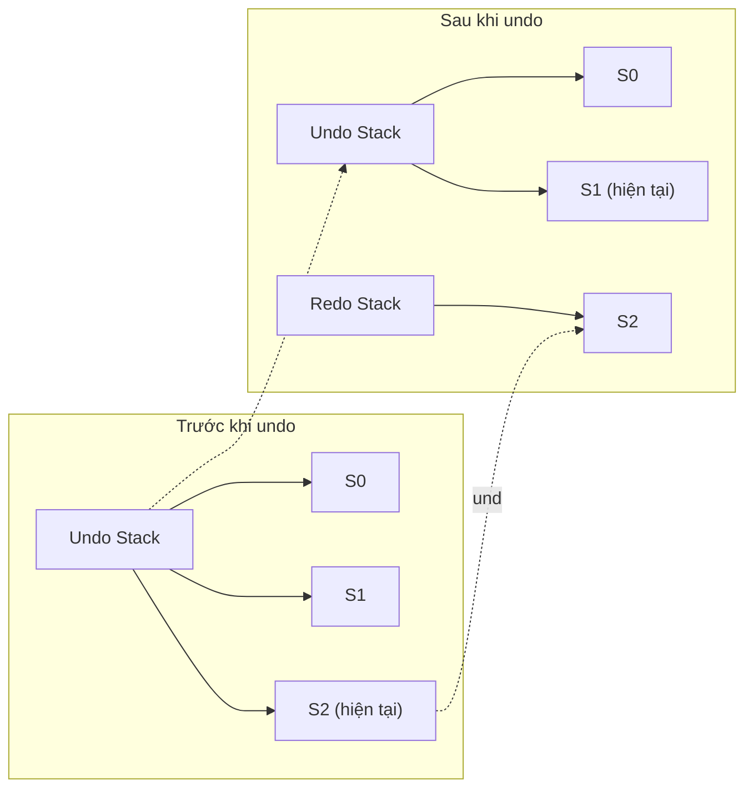
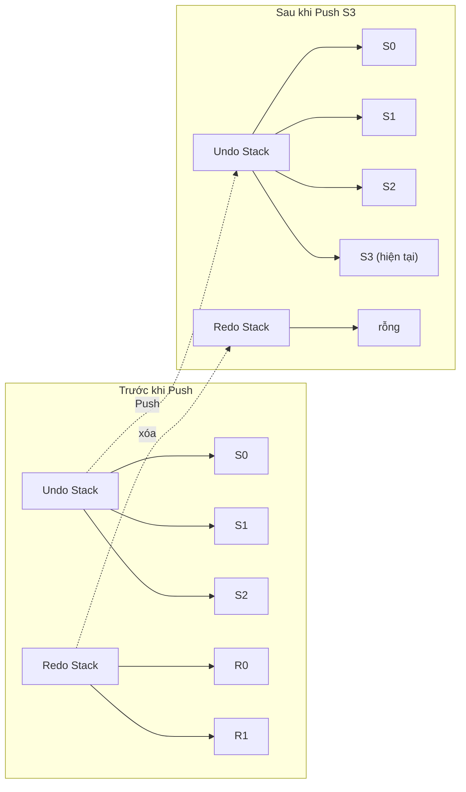
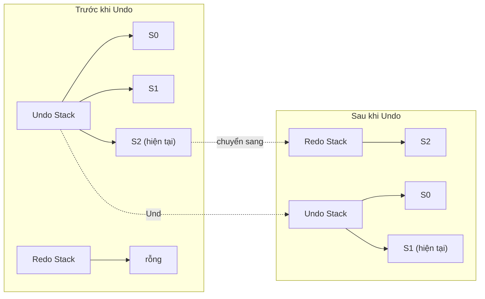
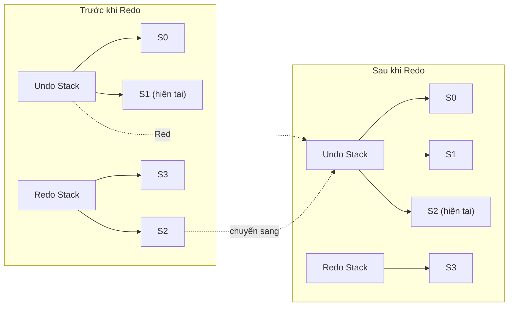

# HistoryStack — Thiết kế chi tiết

> Tài liệu này định nghĩa cấu trúc và thao tác của stack lịch sử dùng cho hoàn tác và làm lại trong F-Shot.

---

## 1. Mục đích

`HistoryStack` là cấu trúc dữ liệu bất biến lưu trữ chuỗi các snapshot của overlay. Nó cho phép người dùng quay lại trạng thái trước đó bằng hoàn tác, hoặc khôi phục trạng thái đã hoàn tác bằng làm lại.

HistoryStack không chứa logic về cách vẽ, cách chụp, hay cách xuất ảnh. Nó chỉ quản lý danh sách snapshot và cung cấp các thao tác cơ bản.

---

## 2. Cấu trúc dữ liệu

HistoryStack bao gồm ba thành phần chính:

- **Undo stack**: danh sách các snapshot đã được ghi nhận theo thứ tự thời gian. Snapshot cuối cùng là trạng thái hiện tại.
- **Redo stack**: danh sách các snapshot đã bị đẩy ra khỏi undo stack khi người dùng hoàn tác.
- **Limit**: giới hạn số lượng snapshot tối đa trong undo stack. Giá trị này được lấy từ cấu hình, mặc định là 100 trong SRS.

Mối quan hệ giữa các thành phần được minh họa như sau:



Khi một snapshot mới được đẩy vào, nó nằm ở đỉnh undo stack. Khi undo, snapshot ở đỉnh undo stack chuyển sang đỉnh redo stack. Khi redo, snapshot ở đỉnh redo stack quay lại đỉnh undo stack.

---

## 3. Undo stack

Undo stack là danh sách các snapshot đã được ghi nhận theo thứ tự thời gian. Snapshot đầu tiên trong danh sách là trạng thái ban đầu. Snapshot cuối cùng là trạng thái hiện tại.

Ví dụ, sau ba thao tác vẽ, undo stack chứa bốn snapshot: một rỗng ban đầu và ba snapshot sau mỗi lần commit.

### 2.2 Redo stack

Redo stack là danh sách các snapshot đã bị đẩy ra khỏi undo stack khi người dùng hoàn tác. Khi người dùng làm lại, snapshot từ redo stack được chuyển trở lại undo stack.

Ví dụ, người dùng vẽ ba nét Pencil, sau đó nhấn `Ctrl + Z` hai lần. Undo stack còn hai snapshot, redo stack chứa hai snapshot vừa bị hoàn tác.

### 2.3 Giới hạn kích thước

HistoryStack có một giới hạn tối đa về số lượng snapshot trong undo stack. Giá trị này được lấy từ cấu hình, mặc định là 100 trong SRS.

Khi undo stack vượt quá giới hạn, snapshot cũ nhất bị loại bỏ. Redo stack không bị giới hạn theo cách tương tự, nhưng trong thực tế nó hiếm khi lớn hơn undo stack.

---

## 4. Trạng thái hiện tại

Trạng thái hiện tại của overlay luôn là snapshot nằm ở đỉnh của undo stack. Không có biến riêng để chỉ định trạng thái hiện tại.

Ví dụ, nếu undo stack chứa các snapshot S0, S1, S2 theo thứ tự, thì S2 là trạng thái hiện tại. Sau khi undo một bước, undo stack là S0, S1, và S1 trở thành trạng thái hiện tại.

Sơ đồ minh họa:



---

## 5. Các thao tác cơ bản

### 5.1 Push

Thao tác Push thêm một snapshot mới vào đỉnh undo stack. Khi Push xảy ra, toàn bộ redo stack bị xóa, vì một thao tác mới làm mất ý nghĩa của các redo trước đó.

Nếu sau khi thêm snapshot, undo stack vượt quá giới hạn `Limit`, các snapshot cũ nhất ở đầu danh sách bị loại bỏ. Snapshot ban đầu có thể bị loại bỏ nếu số lượng snapshot vượt quá giới hạn. Điều này có nghĩa là người dùng không thể undo về trước giới hạn đó.

Công thức trừu tượng:

```text
Push(state, snapshot, limit) =
  combinedUndo = undoStack @ [snapshot]
  if length(combinedUndo) > limit then
    newUndo = drop(length(combinedUndo) - limit, combinedUndo)
  else
    newUndo = combinedUndo
  newRedo = []
```

Trong đó `drop(n, list)` loại bỏ `n` phần tử đầu tiên của danh sách.

Ví dụ, giới hạn là 3. Undo stack hiện có S0, S1, S2. Người dùng commit tạo snapshot S3. Sau khi Push, danh sách trước khi cắt là S0, S1, S2, S3. Vì vượt giới hạn 3, snapshot S0 bị loại. Undo stack kết quả là S1, S2, S3. Redo stack rỗng.

Sơ đồ Push với cắt giới hạn:

```mermaid
graph LR
    subgraph Trước khi Push
        U1[Undo Stack] --> S0a[S0]
        U1 --> S1a[S1]
        U1 --> S2a["S2 (hiện tại)"]
    end

    subgraph Sau khi Push S3, limit=3
        U2[Undo Stack] --> S1b[S1]
        U2 --> S2b[S2]
        U2 --> S3b["S3 (hiện tại)"]
        discarded[S0 bị loại bỏ]
    end

    U1 -.Push.-> U2
    S0a -.loại bỏ.-> discarded
```

Ví dụ thứ hai, undo stack hiện có S0, S1, S2, redo stack có R0, R1. Người dùng commit một Annotation mới, tạo snapshot S3. Sau Push, undo stack là S0, S1, S2, S3, redo stack rỗng (giả sử giới hạn đủ lớn).

Sơ đồ Push:



### 5.2 Undo

Thao tác Undo di chuyển snapshot ở đỉnh undo stack sang redo stack, sau đó trả về snapshot mới ở đỉnh undo stack làm trạng thái hiện tại.

Công thức trừu tượng:

```text
Undo(state) =
  if length(undoStack) <= 1 then None
  else
    current = last(undoStack)
    newUndo = init(undoStack)
    newRedo = current :: redoStack
    return last(newUndo)
```

`init` là phép toán lấy danh sách trừ phần tử cuối.

Ví dụ, undo stack có S0, S1, S2. Sau Undo, undo stack là S0, S1, redo stack là S2. Trạng thái hiện tại là S1.

Sơ đồ Undo:



Nếu undo stack chỉ có một snapshot, Undo không thực hiện được và trả về trạng thái hiện tại.

### 5.3 Redo

Thao tác Redo di chuyển snapshot ở đỉnh redo stack sang undo stack, sau đó trả về snapshot mới ở đỉnh undo stack.

Công thức trừu tượng:

```text
Redo(state) =
  if redoStack is empty then None
  else
    restored = head(redoStack)
    newRedo = tail(redoStack)
    newUndo = undoStack @ [restored]
    return restored
```

Ví dụ, undo stack là S0, S1, redo stack là S2, S3. Sau Redo, undo stack là S0, S1, S2, redo stack là S3. Trạng thái hiện tại là S2.

Sơ đồ Redo:



Nếu redo stack rỗng, Redo không thực hiện được.

### 5.4 CanUndo và CanRedo

Hai thuộc tính này cho biết liệu thao tác undo hoặc redo có khả thi hay không.

- `CanUndo` đúng khi undo stack có nhiều hơn một snapshot.
- `CanRedo` đúng khi redo stack không rỗng.

Ví dụ, sau khi mở overlay và chưa vẽ gì, undo stack chỉ có một snapshot nên `CanUndo` sai. Sau khi vẽ một nét và undo, redo stack chứa một snapshot nên `CanRedo` đúng.

### 5.5 Giới hạn và cấu hình

Giá trị giới hạn `Limit` được cung cấp từ Config. Giá trị mặc định là 100, theo yêu cầu SRS FR-UNDO-003. Người dùng có thể điều chỉnh giá trị này trong cài đặt.

Khi giới hạn thay đổi trong lúc chạy, hệ thống không cắt ngay undo stack. Cắt chỉ xảy ra tại lần Push tiếp theo. Nếu giới hạn mới nhỏ hơn kích thước hiện tại, các snapshot cũ nhất sẽ bị loại khi Push.

Ví dụ, undo stack hiện có 80 snapshot. Người dùng đổi giới hạn xuống 50. Cho đến lần Push tiếp theo, 80 snapshot vẫn được giữ. Lần Push tiếp theo sẽ cắt về 50 snapshot gần nhất, loại bỏ 31 snapshot cũ nhất.

### 5.6 Hậu quả khi đạt giới hạn

Khi undo stack đạt giới hạn và bị cắt, các snapshot bị loại không thể khôi phục bằng undo. Tuy nhiên, điều này không ảnh hưởng đến redo stack vì redo stack luôn bị xóa khi Push.

Ví dụ, giới hạn là 3. Người dùng thực hiện 5 thao tác commit, tạo snapshot S1 đến S5. Undo stack sau mỗi lần Push:

- Sau S1: S0, S1
- Sau S2: S0, S1, S2
- Sau S3: S0, S1, S2, S3 → cắt thành S1, S2, S3
- Sau S4: S1, S2, S3, S4 → cắt thành S2, S3, S4
- Sau S5: S2, S3, S4, S5 → cắt thành S3, S4, S5

Sau S5, người dùng chỉ có thể undo tối đa 3 bước, tức là quay lại S2. Snapshot S0 và S1 đã bị loại bỏ vĩnh viễn.

---

## 6. Tính bất biến

HistoryStack bất biến. Mỗi thao tác Push, Undo, Redo đều trả về một HistoryStack mới thay vì sửa đổi HistoryStack cũ. Điều này phù hợp với ngôn ngữ F# và giúp việc kiểm thử trở nên đơn giản.

Ví dụ:

- Stack ban đầu H0.
- Sau Push: H1 là một stack mới, H0 không thay đổi.
- Sau Undo trên H1: H2 là một stack mới.
- Nếu sau đó Push trên H2, H1 vẫn giữ redo stack cũ.

---

## 7. Phạm vi trong MVP

Trong MVP, HistoryStack cần hỗ trợ:

- Push snapshot sau khi commit Annotation.
- Push snapshot sau khi xóa Annotation.
- Undo bằng `Ctrl + Z`.
- Redo bằng `Ctrl + Shift + Z` hoặc `Ctrl + Y`.
- Giới hạn undo stack theo cấu hình.

Không cần hỗ trợ trong MVP:

- Gộp nhiều nét Pencil liên tiếp thành một bước undo.
- Lưu trạng thái công cụ đang chọn.
- Lưu chỉ số counter cho CircleCounter tool.

Các tính năng này thuộc phạm vi v1.x.

---

## 8. Kết nối với các phần khác

- **Snapshot:** là phần tử được lưu trong HistoryStack.
- **Overlay State Machine:** gọi Push khi có thao tác cần lưu lịch sử, gọi Undo/Redo khi người dùng nhấn phím tắt.
- **Config:** cung cấp giá trị giới hạn stack.
- **UI:** hiển thị trạng thái hiện tại dựa trên snapshot ở đỉnh undo stack.

---

*HistoryStack định nghĩa xong các thao tác cốt lõi. Tiếp theo, `05_04_Integration.md` sẽ mô tả cách HistoryStack tích hợp vào luồng overlay.*
