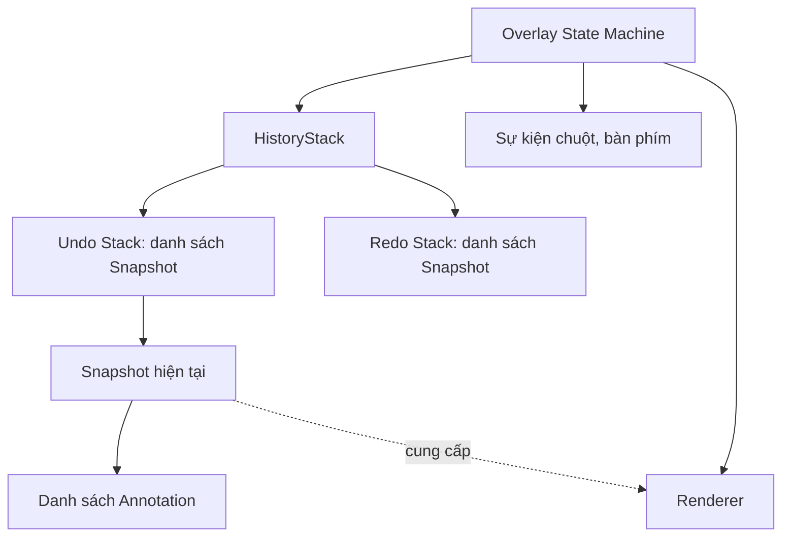
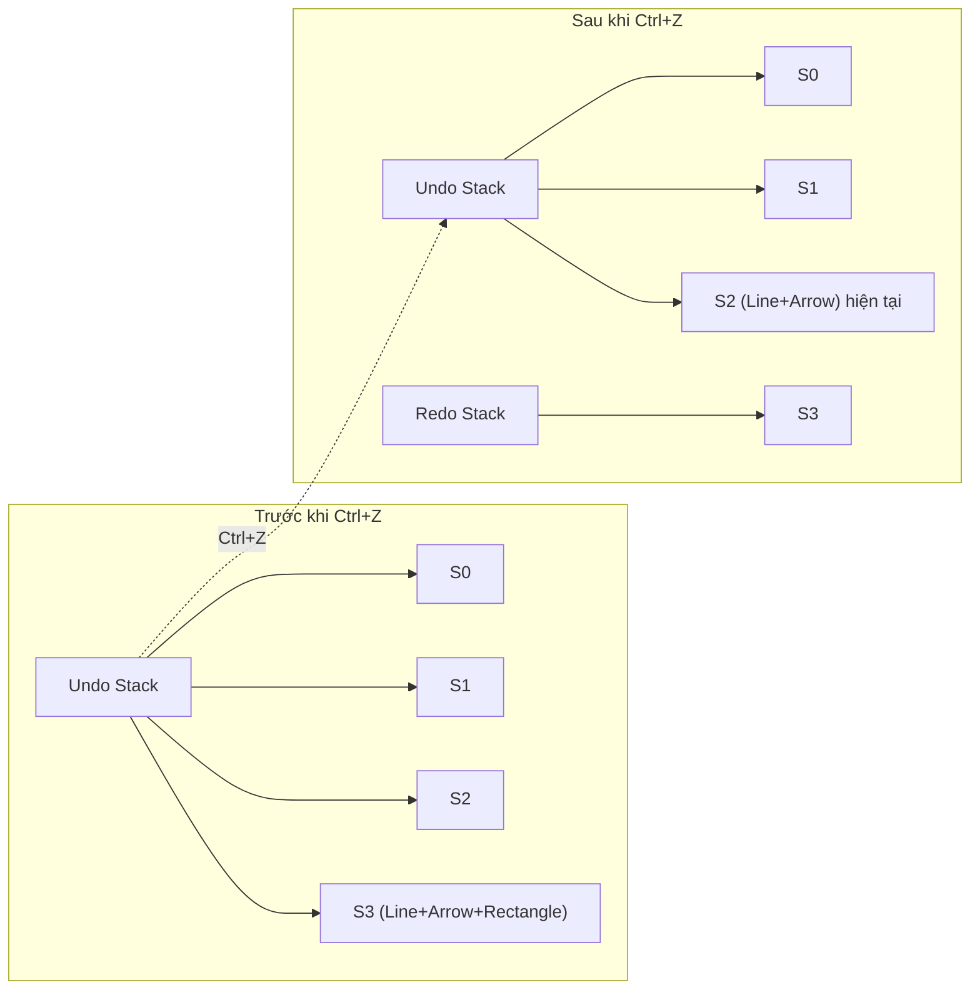
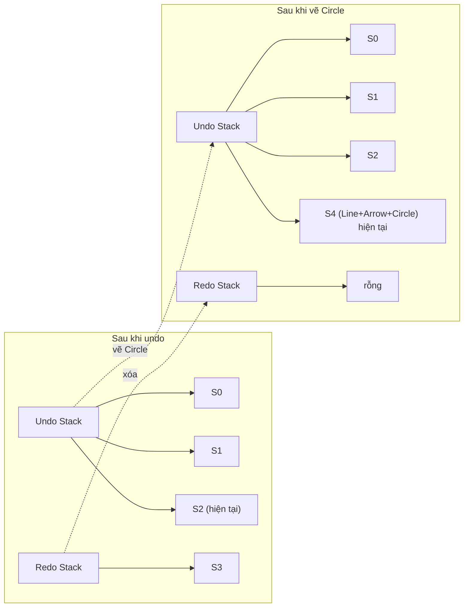

# Integration — Thiết kế chi tiết

> Tài liệu này mô tả cách HistoryStack và Snapshot được tích hợp vào luồng làm việc của overlay trong F-Shot.

---

## 1. Mục đích

HistoryStack không tự hoạt động. Nó cần được gọi bởi Overlay State Machine khi các sự kiện thay đổi danh sách chú thích xảy ra. Tài liệu này định nghĩa:

- Khi nào phải tạo snapshot mới.
- Khi nào gọi Push.
- Khi nào gọi Undo/Redo.
- Cách chuyển đổi giữa các snapshot trong luồng render.

---

## 2. Cấu trúc dữ liệu trong luồng overlay

Overlay State Machine sở hữu một `HistoryStack`. Mỗi khi có thao tác thay đổi danh sách Annotation, State Machine tạo `Snapshot` mới và gọi `Push`. Khi người dùng nhấn phím tắt, State Machine gọi `Undo` hoặc `Redo` và chuyển snapshot hiện tại cho renderer.

Trong đó, Renderer không truy cập trực tiếp HistoryStack. Nó chỉ nhận snapshot hiện tại và vẽ danh sách Annotation trong đó.

---

## 3. Các sự kiện tạo snapshot

### 3.1 Commit Annotation

Mỗi khi người dùng hoàn tất một thao tác vẽ, Annotation mới được commit. Sau khi commit, hệ thống tạo snapshot mới chứa danh sách Annotation cập nhật và đẩy vào HistoryStack.

Ví dụ:

1. Người dùng chọn công cụ Line.
2. Nhấn chuột tại A, kéo đến B, thả chuột.
3. Preview Line(A, B) được chuyển thành Annotation Line(A, B).
4. Annotation mới được thêm vào danh sách cũ.
5. Snapshot mới được tạo và Push.

### 2.2 Xóa Annotation

Khi người dùng xóa một Annotation, danh sách chú thích thay đổi. Hệ thống tạo snapshot mới chứa danh sách đã xóa và Push.

Trong MVP, việc xóa từng Annotation chưa được hỗ trợ qua UI. Tuy nhiên, nếu có phím tắt hoặc cơ chế xóa, nó vẫn phải tạo snapshot để đảm bảo undo hoạt động.

### 2.3 Thay đổi vùng chọn

Trong MVP, việc di chuyển hoặc resize vùng chọn **không** tạo snapshot. Lý do là vùng chọn chưa được coi là một phần của ảnh kết quả. Chỉ khi nào có tương tác với Annotation trên vùng chọn đã chọn, snapshot mới được tạo.

Ví dụ, người dùng kéo vùng chọn từ (100, 100, 500, 400) sang (200, 200, 600, 500): không có snapshot. Sau đó vẽ một mũi tên trên vùng chọn mới: snapshot được tạo và lưu cả vùng chọn lúc đó.

### 2.4 Thay đổi style hoặc công cụ

Việc chuyển công cụ, đổi màu, hoặc thay đổi độ dày nét không tạo snapshot trong MVP. Những thay đổi này ảnh hưởng đến Annotation sắp vẽ, không ảnh hưởng đến Annotation đã commit.

Trong v1.x, nếu hỗ trợ chỉnh sửa Annotation đã commit, việc thay đổi style của Annotation cũ sẽ tạo snapshot mới.

---

## 4. Luồng Undo và Redo

### 4.1 Undo từ UI

Khi người dùng nhấn `Ctrl + Z`, Overlay State Machine gọi Undo trên HistoryStack. Nếu Undo thành công, trạng thái hiện tại chuyển sang snapshot trước đó. UI render lại theo snapshot mới.

Ví dụ:

1. Người dùng vẽ Line, vẽ Arrow, vẽ Rectangle. Undo stack: S0, S1, S2, S3.
2. Nhấn `Ctrl + Z`. Undo stack: S0, S1, S2. Redo stack: S3.
3. UI render theo S2: chỉ hiển thị Line và Arrow.

Sơ đồ:

### 4.2 Redo từ UI

Khi người dùng nhấn `Ctrl + Shift + Z` hoặc `Ctrl + Y`, Overlay State Machine gọi Redo. Nếu Redo thành công, snapshot từ redo stack được đưa trở lại undo stack.

Ví dụ, tiếp theo ví dụ trên:

1. Nhấn `Ctrl + Shift + Z`. Undo stack: S0, S1, S2, S3. Redo stack: rỗng.
2. UI render theo S3: hiển thị Line, Arrow, Rectangle.

### 4.3 Thao tác mới sau khi undo

Nếu người dùng undo rồi thực hiện một thao tác mới, redo stack bị xóa. Thao tác mới tạo snapshot mới và đẩy lên đỉnh undo stack.

Ví dụ, sau khi undo về S2, người dùng vẽ một Circle. Undo stack: S0, S1, S2, S4. Redo stack: rỗng. Snapshot S3 bị loại bỏ và không thể redo nữa.

Sơ đồ:

---

## 5. Tích hợp với render

### 5.1 Lấy trạng thái hiện tại

Renderer luôn lấy snapshot ở đỉnh undo stack làm nguồn dữ liệu. Nó không cần biết lịch sử đã xảy ra, chỉ cần danh sách Annotation trong snapshot hiện tại.

Ví dụ, khi undo, Overlay State Machine không cần thông báo renderer về thao tác undo cụ thể. Nó chỉ cần cung cấp snapshot mới. Renderer vẽ lại toàn bộ scene dựa trên snapshot đó.

### 4.2 Render sau mỗi thao tác

Sau khi Push, Undo, hoặc Redo, Overlay State Machine gửi snapshot hiện tại cho renderer. Renderer xóa canvas cũ và vẽ lại screenshot, dimming, vùng chọn, và danh sách Annotation.

Ví dụ, người dùng nhấn `Ctrl + Z` sau khi vẽ ba nét. Renderer nhận snapshot mới chỉ chứa hai nét, và vẽ lại scene tương ứng.

---

## 5. Tích hợp với State Machine

### 5.1 Trạng thái Annotating

Overlay State Machine có trạng thái `Annotating` khi người dùng đang vẽ. Trong trạng thái này, các sự kiện chuột tạo preview tạm thời. Preview không được lưu vào snapshot. Chỉ khi commit, preview mới chuyển thành Annotation và snapshot mới được Push.

Ví dụ, người dùng đang vẽ Pencil. Mỗi lần di chuyển chuột chỉ cập nhật preview. Khi thả chuột, preview được commit, snapshot mới chứa Pencil được Push.

### 5.2 Trạng thái Text Editing

Khi người dùng đang nhập văn bản, preview được hiển thị qua control nhập liệu của UI. Nếu người dùng nhấn Enter, Text Annotation được commit và snapshot mới được Push. Nếu người dùng nhấn Escape, preview bị hủy và không có snapshot mới.

### 5.3 Trạng thái Selecting

Khi người dùng đang kéo vùng chọn, không có preview hay snapshot nào. Vùng chọn được cập nhật trực tiếp trong trạng thái tạm. Sau khi thả chuột, vùng chọn chuyển sang `Selected` và sẵn sàng cho các thao tác tiếp theo.

---

## 6. Tích hợp với Config

Giới hạn của HistoryStack được lấy từ cấu hình. Khi overlay khởi động, HistoryStack được tạo với giới hạn này. Giá trị mặc định là 100, theo FR-UNDO-003 trong SRS. Người dùng có thể điều chỉnh trong khoảng cho phép, ví dụ từ 10 đến 1000.

Nếu cấu hình thay đổi trong lúc chạy, giới hạn mới chỉ áp dụng cho các snapshot đẩy vào sau đó. Các snapshot cũ đã vượt quá giới hạn mới sẽ bị cắt bớt ở lần Push tiếp theo.

Ví dụ, giới hạn ban đầu là 100. Người dùng đổi thành 50. Cho đến lần Push tiếp theo, undo stack vẫn giữ 100 snapshot. Lần Push tiếp theo sẽ cắt về 50.

Khi người dùng đặt giới hạn quá thấp, ví dụ 1, hệ thống vẫn tôn trọng giá trị đó. Tuy nhiên, với giới hạn 1, undo stack chỉ chứa snapshot hiện tại, nên thao tác undo gần như không khả thi. Trong MVP, giá trị tối thiểu khuyến nghị là 10 để duy trì khả năng hoàn tác cơ bản.

### 6.1 Giới hạn và trải nghiệm người dùng

Giới hạn undo ảnh hưởng đến số bước người dùng có thể quay lại. Giá trị lớn cho phép undo nhiều hơn nhưng tốn nhiều bộ nhớ hơn. Giá trị nhỏ tiết kiệm bộ nhớ nhưng hạn chế undo.

Trong MVP, giá trị mặc định 100 được chọn vì:

- Đủ cho hầu hết các phiên chụp thông thường.
- Mỗi snapshot chỉ lưu danh sách Annotation, không lưu bitmap, nên bộ nhớ không lớn.
- Không gây trễ khi Push/Undo.

Nếu sau này snapshot mở rộng để lưu thêm dữ liệu lớn, giá trị mặc định có thể được xem xét lại.

---

## 7. Phạm vi trong MVP

Trong MVP, tích hợp HistoryStack cần đảm bảo:

- Mỗi commit Annotation tạo snapshot và Push.
- Mỗi xóa Annotation tạo snapshot và Push.
- `Ctrl + Z` gọi Undo.
- `Ctrl + Shift + Z` / `Ctrl + Y` gọi Redo.
- Renderer luôn dùng snapshot hiện tại.
- Giới hạn undo stack được lấy từ Config, mặc định 100.

Không cần trong MVP:

- Undo di chuyển/resize vùng chọn.
- Gộp nhiều nét Pencil liên tiếp thành một bước undo.
- Khôi phục counter sau undo/redo.
- Lưu trạng thái công cụ đang chọn.

---

## 8. Câu hỏi cần quyết định

| Câu hỏi | Tác động |
|---------|----------|
| Có push snapshot khi di chuyển/resize vùng chọn không? | Ảnh hưởng undo behavior và số lượng snapshot |
| Có gộp nhiều nét Pencil liên tiếp thành một bước undo không? | Ảnh hưởng UX khi vẽ tự do |
| Giới hạn stack mặc định bao nhiêu? | Ảnh hưởng bộ nhớ và số bước hoàn tác |
| Có lưu counter state trong snapshot không? | Ảnh hưởng CircleCounter tool trong v1.x |

---

## 9. Kết nối với các phần khác

- **HistoryStack:** cung cấp Push, Undo, Redo.
- **Snapshot:** là dữ liệu được truyền vào HistoryStack.
- **Overlay State Machine:** quyết định khi nào gọi các thao tác lịch sử.
- **Annotation:** nội dung chính trong snapshot.
- **Selection:** có thể được lưu trong snapshot trong tương lai, nhưng không trong MVP.
- **Config:** cung cấp giới hạn stack.
- **Rendering.Skia:** vẽ snapshot hiện tại.

---

*Sau khi chốt tích hợp History, toàn bộ nhóm History hoàn thiện. Tiếp theo là P1.03: Overlay State Machine.*
