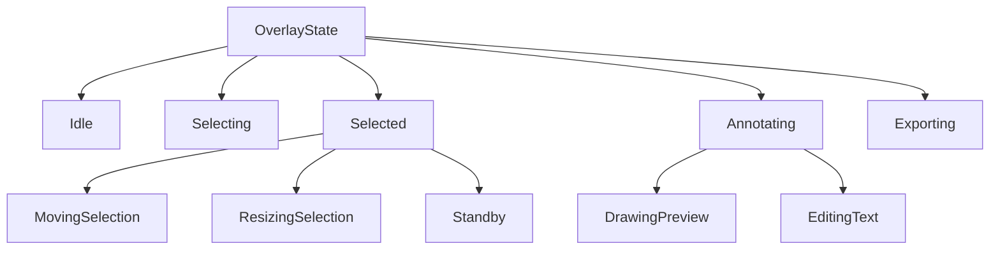

# States — Thiết kế chi tiết

> Tài liệu này định nghĩa các trạng thái của overlay trong suốt phiên chụp, cùng với dữ liệu đi kèm và các ràng buộc bất biến.

---

## 1. Mục đích

`OverlayState` mô hình hóa toàn bộ vòng đời của cửa sổ chụp bằng một máy trạng thái hữu hạn. Mỗi trạng thái thể hiện một giai đoạn tương tác khác nhau và mang theo dữ liệu riêng cần thiết để xử lý sự kiện tiếp theo.

Mục tiêu là tách biệt hoàn toàn logic trạng thái khỏi UI và rendering. State machine chỉ nhận input, tính toán trạng thái kế tiếp, và trả về dữ liệu để UI vẽ lại.

---

## 2. Các trạng thái chính

### 2.1 Idle

Đây là trạng thái ban đầu ngay sau khi overlay mở. Màn hình được phủ một lớp tối mờ toàn bộ, con trỏ chuột thay đổi thành dạng crosshair, và chưa có vùng chọn nào.

Dữ liệu đi kèm:

- Khung chụp toàn bộ màn hình ảo.
- Hình ảnh nền đã chụp được, dùng để hiển thị và xuất kết quả.
- Cấu hình hiện tại bao gồm công cụ mặc định, màu sắc, độ dày nét, giới hạn lịch sử.
- Lịch sử trạng thái `HistoryStack` rỗng hoặc chứa snapshot ban đầu.

Ràng buộc:

- Vùng chọn chưa tồn tại.
- Không có preview annotation.
- Có thể nhận phím tắt hủy hoặc chuyển chế độ chụp.

### 2.2 Selecting

Trạng thái này bắt đầu khi người dùng nhấn chuột trái trong vùng overlay và bắt đầu kéo. Mục đích là xác định vùng chọn bằng cách kéo từ điểm bắt đầu đến điểm hiện tại của con trỏ.

Dữ liệu đi kèm:

- Điểm bắt đầu nhấn chuột.
- Tọa độ chuột hiện tại.
- Hình chữ nhật tạm thời được tính từ hai điểm trên, đã được clamp trong phạm vi chụp.
- Cấu hình và lịch sử như trong `Idle`.

Ràng buộc:

- Chỉ xảy ra khi chưa có vùng chọn.
- Nếu người dùng thả chuột khi vùng quá nhỏ, hệ thống có thể quay về `Idle` hoặc vẫn chuyển sang `Selected` tùy quyết định UX.
- Không hiển thị toolbar trong trạng thái này.

### 2.3 Selected

Trạng thái này xuất hiện sau khi người dùng hoàn tất việc kéo vùng chọn. Vùng chọn đã cố định, hiển thị viền và tám điểm neo. Toolbar nổi xuất hiện gần vùng chọn để chọn công cụ hoặc thực hiện hành động.

Dữ liệu đi kèm:

- Hình chữ nhật vùng chọn cuối cùng.
- Tám điểm neo để resize: bốn góc và bốn trung điểm cạnh.
- Trạng thái tương tác phụ bên trong: có thể đang di chuyển vùng chọn, đang co giãn vùng chọn, hoặc chỉ đứng yên.
- Danh sách chú thích đã commit, lấy từ snapshot hiện tại của `HistoryStack`.
- Công cụ đang được chọn để vẽ.

Ràng buộc:

- Vùng chọn luôn nằm trong phạm vi chụp.
- Toolbar chỉ hiển thị khi vùng chọn đủ lớn.
- Từ `Selected` có thể chuyển sang `Annotating` khi người dùng bắt đầu một thao tác vẽ.

#### 2.3.1 Sub-state MovingSelection

Khi người dùng nhấn chuột bên trong vùng chọn và kéo, toàn bộ vùng chọn được di chuyển. Sub-state này chỉ tồn tại trong khi chuột được giữ.

Dữ liệu bổ sung:

- Điểm chuột tại thời điểm bắt đầu di chuyển.
- Offset giữa điểm bắt đầu và gốc của vùng chọn.

#### 2.3.2 Sub-state ResizingSelection

Khi người dùng nhấn vào một trong tám điểm neo, vùng chọn được co giãn theo hướng tương ứng. Sub-state này cũng chỉ tồn tại trong khi chuột được giữ.

Dữ liệu bổ sung:

- Điểm neo đang được kéo.
- Hướng co giãn tương ứng với điểm neo đó.
- Vùng chọn ban đầu trước khi bắt đầu co giãn.

### 2.4 Annotating

Trạng thái này bao gồm mọi hoạt động tạo hoặc chỉnh sửa chú thích. Khi người dùng chọn một công cụ vẽ và bắt đầu tương tác, overlay chuyển từ `Selected` sang `Annotating`.

Dữ liệu đi kèm:

- Công cụ đang vẽ: Pencil, Line, Arrow, Rectangle, Circle, Marker, Text, Pixelate.
- Preview của annotation đang được tạo. Preview này chưa được commit và chưa được lưu vào `HistoryStack`.
- Danh sách các annotation đã commit từ snapshot hiện tại.
- Vùng chọn vẫn giữ nguyên.

Ràng buộc:

- Preview chỉ là dữ liệu tạm, không ảnh hưởng đến lịch sử.
- Khi thả chuột hoặc xác nhận, preview được chuyển thành annotation commit và `HistoryStack.Push` được gọi.
- Nếu người dùng nhấn `Esc` trong lúc vẽ, preview bị hủy và quay về `Selected`.

#### 2.4.1 Sub-state EditingText

Trường hợp đặc biệt của `Annotating` dành cho công cụ Text. Khi người dùng chọn vị trí đặt text, UI hiển thị một control nhập liệu tạm thời để người dùng gõ. Sub-state này tồn tại cho đến khi nhấn Enter để commit hoặc Esc để hủy.

Dữ liệu bổ sung:

- Vị trí đặt text.
- Nội dung text đang nhập.
- Style text hiện tại.

### 2.5 Exporting

Trạng thái này xuất hiện khi người dùng yêu cầu xuất ảnh, ví dụ nhấn `Ctrl+S` hoặc `Ctrl+C`. Trong `Exporting`, state machine tạm dừng tương tác chuột và bàn phím, chờ lệnh xuất hoàn thành.

Dữ liệu đi kèm:

- Vùng chọn cuối cùng.
- Danh sách annotation đã commit.
- Target xuất: file, clipboard, hoặc stdout.
- Trạng thái chờ kết quả.

Ràng buộc:

- Chỉ có thể xuất khi đã có vùng chọn.
- Sau khi xuất thành công, overlay có thể đóng hoặc quay về `Selected` tùy cấu hình.
- Nếu xuất thất bại, quay về `Selected` để người dùng có thể thử lại.

---

## 3. Cấu trúc phân cấp trạng thái

Các trạng thái có thể được nhìn nhận theo hai cấp độ:

- **Trạng thái chính**: `Idle`, `Selecting`, `Selected`, `Annotating`, `Exporting`.
- **Sub-state tương tác**: `MovingSelection`, `ResizingSelection`, `EditingText`. Các sub-state này không phải là trạng thái độc lập hoàn toàn mà là biến thể của `Selected` hoặc `Annotating`.

Sơ đồ phân cấp:

Trong đó `Standby` là sub-state mặc định của `Selected` khi người dùng không đang kéo hay co giãn.

---

## 4. Dữ liệu chung cho mọi trạng thái

Dù ở trạng thái nào, state machine luôn cần một số dữ liệu nền:

- **CaptureResult**: hình ảnh toàn màn hình ảo, kích thước, thông tin màn hình.
- **ConfigSnapshot**: bản sao cấu hình tại thời điểm overlay mở, dùng để xác định công cụ mặc định, màu, giới hạn lịch sử.
- **HistoryStack**: stack lịch sử bất biến, lưu các snapshot đã commit.
- **CurrentTool**: công cụ đang được chọn để vẽ.
- **CurrentStyle**: màu sắc, độ dày nét, cỡ chữ hiện tại.

---

## 5. Invariants — những điều kiện luôn đúng

Trong mọi trạng thái, các điều kiện sau phải được đảm bảo:

- `HistoryStack` không bao giờ rỗng: luôn có ít nhất một snapshot.
- Vùng chọn, nếu có, luôn là hình chữ nhật hợp lệ với chiều rộng và chiều cao không âm.
- Vùng chọn luôn nằm trong phạm vi chụp, có thể sau khi clamp.
- Danh sách annotation đã commit được lấy từ `HistoryStack.Current`.
- Preview annotation chỉ tồn tại trong `Annotating` và các sub-state liên quan.
- Toolbar chỉ hiển thị trong `Selected` và `Annotating`.

---

## 6. Phạm vi trong MVP

Trong MVP, state machine cần hỗ trợ đầy đủ các trạng thái chính `Idle`, `Selecting`, `Selected`, `Annotating`, `Exporting`, cùng với các sub-state `MovingSelection`, `ResizingSelection`, `EditingText`.

Không cần trong MVP:

- Chuyển đổi công cụ khi đang trong sub-state `MovingSelection` hoặc `ResizingSelection`.
- Lưu lịch sử cho việc di chuyển hoặc co giãn vùng chọn.
- Undo việc thay đổi công cụ hoặc style.

---

## 7. Kết nối với các file thiết kế khác

- **08_03_Events.md**: định nghĩa input kích hoạt chuyển trạng thái.
- **08_04_Transitions.md**: mô tả luồng chuyển giữa các trạng thái.
- **08_05_RenderModel.md**: đầu ra để UI vẽ từng trạng thái.
- **08_06_Integration.md**: tích hợp với Selection, Annotation, History.
- **05_03_HistoryStack.md**: stack lịch sử được tham chiếu trong mọi trạng thái.
- **04_02_ToolModel.md**: công cụ annotation được dùng trong `Annotating`.

---

*Các trạng thái đã được định nghĩa. Tiếp theo, `08_03_Events.md` sẽ mô tả các sự kiện kích hoạt chuyển trạng thái.*
