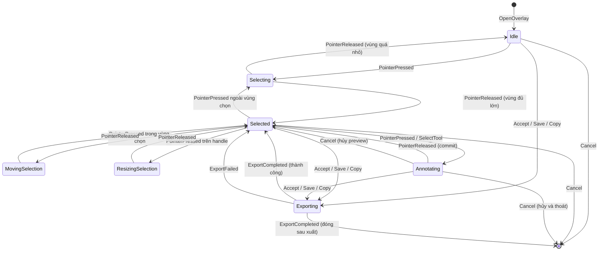

# Transitions — Thiết kế chi tiết

> Tài liệu này mô tả luồng chuyển trạng thái của OverlayState khi nhận các sự kiện đầu vào.

---

## 1. Mục đích

Transition định nghĩa cách OverlayState phản ứng với mỗi sự kiện trong mỗi trạng thái. Mỗi transition trả về trạng thái mới, có thể kèm theo các commands để UI/platform thực hiện.

Mục tiêu là đảm bảo hành vi của overlay dự đoán được, dễ kiểm thử, và không có đường chuyển trạng thái không mong muốn.

---

## 2. Ký hiệu

Trong tài liệu này, mỗi transition được mô tả theo dạng:

```text
CurrentState + Event → NextState [kèm tác dụng phụ]
```

Trong đó:

- `CurrentState` là trạng thái trước khi nhận sự kiện.
- `Event` là sự kiện đầu vào.
- `NextState` là trạng thái sau khi xử lý.
- `tác dụng phụ` là các commands hoặc thay đổi dữ liệu cần thiết.

---

## 3. Sơ đồ trạng thái tổng quan



---

## 4. Transitions từ Idle

### 4.1 Idle + PointerPressed → Selecting

Khi người dùng nhấn chuột trong `Idle`, overlay chuyển sang `Selecting`.

Tác dụng phụ:

- Lưu điểm bắt đầu nhấn chuột.
- Khởi tạo hình chữ nhật tạm thời có kích thước 0 hoặc rất nhỏ.
- Thay đổi con trỏ thành dạng crosshair.

### 4.2 Idle + Cancel → CloseOverlay

Khi người dùng nhấn Esc hoặc Q, overlay đóng mà không xuất gì.

### 4.3 Idle + Accept/Save/Copy → Exporting

Nếu chế độ chụp là `FullScreen` hoặc `SingleScreen`, việc nhấn Save hoặc Copy ngay trong `Idle` sẽ xuất toàn bộ màn hình.

Tác dụng phụ:

- Tạo vùng chọn bao toàn bộ màn hình ảo.
- Chuyển sang `Exporting` với target tương ứng.

---

## 5. Transitions từ Selecting

### 5.1 Selecting + PointerMoved → Selecting

Trong khi người dùng kéo chuột, hình chữ nhật vùng chọn được cập nhật liên tục.

Tác dụng phụ:

- Cập nhật tọa độ điểm kết thúc.
- Tính lại hình chữ nhật từ hai điểm bắt đầu và kết thúc.
- Clamp hình chữ nhật trong phạm vi chụp.
- RenderModel cập nhật để hiển thị vùng chọn tạm thời.

### 5.2 Selecting + PointerReleased → Selected

Khi người dùng thả chuột và vùng chọn đủ lớn, overlay chuyển sang `Selected`.

Tác dụng phụ:

- Cố định hình chữ nhật vùng chọn.
- Tạo tám điểm neo.
- Hiển thị toolbar.
- Nếu chế độ chụp `AcceptOnSelect` được bật, chuyển thẳng sang `Exporting` thay vì `Selected`.

### 5.3 Selecting + PointerReleased → Idle

Nếu vùng chọn quá nhỏ sau khi thả chuột, overlay quay về `Idle`.

Ngưỡng cụ thể do cấu hình quyết định, ví dụ tối thiểu 8x8 pixel.

### 5.4 Selecting + Cancel → Idle

Nếu người dùng nhấn Esc trong khi kéo, quá trình tạo vùng chọn bị hủy.

---

## 6. Transitions từ Selected

### 6.1 Selected + PointerPressed trong vùng chọn → MovingSelection

Khi người dùng nhấn chuột bên trong vùng chọn và không trên handle, vùng chọn bắt đầu di chuyển.

Tác dụng phụ:

- Lưu offset giữa điểm nhấn và gốc vùng chọn.
- Chuyển sang sub-state `MovingSelection`.

### 6.2 Selected + PointerPressed trên handle → ResizingSelection

Khi người dùng nhấn vào một điểm neo, vùng chọn bắt đầu co giãn theo hướng của điểm neo đó.

Tác dụng phụ:

- Xác định điểm neo đang được kéo.
- Lưu hình chữ nhật ban đầu.
- Chuyển sang sub-state `ResizingSelection`.

### 6.3 Selected + PointerPressed ngoài vùng chọn → Selecting

Nếu người dùng nhấn chuột ngoài vùng chọn, vùng chọn cũ bị hủy và bắt đầu tạo vùng chọn mới.

Tác dụng phụ:

- Xóa vùng chọn cũ.
- Bắt đầu `Selecting` với điểm bắt đầu mới.

### 6.4 Selected + PointerPressed với công cụ đang chọn → Annotating

Nếu người dùng nhấn chuột trong vùng chọn và công cụ hiện tại là một công cụ annotation, overlay chuyển sang `Annotating`.

Tác dụng phụ:

- Khởi tạo preview của annotation tương ứng với công cụ.
- Với công cụ Text, chuyển sang sub-state `EditingText`.

### 6.5 Selected + SelectTool → Selected

Khi người dùng chọn một công cụ khác từ toolbar hoặc phím tắt, chỉ `CurrentTool` thay đổi, trạng thái vẫn là `Selected`.

### 6.6 Selected + Undo/Redo → Selected

Khi người dùng nhấn Ctrl+Z hoặc Ctrl+Y, `HistoryStack` được cập nhật và danh sách annotation hiện tại thay đổi theo snapshot mới.

Trạng thái vẫn là `Selected`.

### 6.7 Selected + Save/Copy → Exporting

Chuyển sang `Exporting` với target tương ứng.

### 6.8 Selected + Cancel → CloseOverlay

Đóng overlay mà không xuất.

---

## 7. Transitions từ MovingSelection

### 7.1 MovingSelection + PointerMoved → MovingSelection

Vùng chọn được di chuyển theo chuyển động của chuột.

Tác dụng phụ:

- Tính toán vị trí mới của vùng chọn dựa trên offset ban đầu.
- Clamp vùng chọn trong phạm vi chụp.
- Cập nhật RenderModel.

### 7.2 MovingSelection + PointerReleased → Selected

Vùng chọn được cố định ở vị trí mới và quay về `Selected`.

Lưu ý: việc di chuyển vùng chọn không tạo snapshot trong MVP.

---

## 8. Transitions từ ResizingSelection

### 8.1 ResizingSelection + PointerMoved → ResizingSelection

Vùng chọn được co giãn theo hướng của điểm neo.

Tác dụng phụ:

- Tính toán hình chữ nhật mới dựa trên điểm neo và tọa độ chuột.
- Đảm bảo kích thước tối thiểu.
- Clamp trong phạm vi chụp.
- Cập nhật RenderModel.

### 8.2 ResizingSelection + PointerReleased → Selected

Vùng chọn được cố định với kích thước mới và quay về `Selected`.

Việc resize vùng chọn cũng không tạo snapshot trong MVP.

---

## 9. Transitions từ Annotating

### 9.1 Annotating + PointerMoved → Annotating

Preview của annotation được cập nhật theo chuyển động của chuột.

Tác dụng phụ:

- Cập nhật tham số hình học của preview.
- Cập nhật RenderModel để vẽ preview chồng lên snapshot hiện tại.

### 9.2 Annotating + PointerReleased → Selected

Khi người dùng thả chuột, preview được commit.

Tác dụng phụ:

- Chuyển preview thành annotation hoàn chỉnh.
- Tạo danh sách annotation mới gồm các annotation cũ cộng annotation vừa commit.
- Tạo snapshot mới.
- Gọi `HistoryStack.Push`.
- Quay về `Selected`.

### 9.3 Annotating + Cancel → Selected

Nếu người dùng nhấn Esc trong khi vẽ, preview bị hủy.

Tác dụng phụ:

- Xóa preview.
- Không tạo snapshot.
- Quay về `Selected`.

### 9.4 Annotating + SelectTool khác → Annotating hoặc Selected

Nếu người dùng chọn công cụ khác trong khi đang vẽ, có hai khả năng:

- Hủy preview hiện tại, thay đổi `CurrentTool`, và quay về `Selected`.
- Hoặc bỏ qua lệnh chuyển công cụ cho đến khi thao tác hiện tại kết thúc.

Trong MVP, lựa chọn khuyến nghị là hủy preview và quay về `Selected` để tránh trạng thái kẹt.

### 9.5 EditingText + Enter → Selected

Khi người dùng nhấn Enter sau khi nhập text, annotation Text được commit.

Tác dụng phụ:

- Tạo annotation Text từ nội dung đã nhập.
- Push snapshot mới.
- Quay về `Selected`.

### 9.6 EditingText + Escape → Selected

Khi người dùng nhấn Escape trong khi nhập text, control nhập liệu bị hủy.

Tác dụng phụ:

- Xóa preview text.
- Không tạo snapshot.
- Quay về `Selected`.

---

## 10. Transitions từ Exporting

### 10.1 Exporting + ExportCompleted (thành công, đóng overlay) → CloseOverlay

Nếu cấu hình yêu cầu đóng overlay sau khi xuất, overlay đóng.

### 10.2 Exporting + ExportCompleted (thành công, giữ overlay) → Selected

Nếu cấu hình yêu cầu giữ overlay sau khi xuất, quay về `Selected`.

### 10.3 Exporting + ExportFailed → Selected

Nếu xuất thất bại, overlay quay về `Selected` để người dùng có thể thử lại hoặc thay đổi target.

---

## 11. Các transitions bị cấm

Một số kết hợp trạng thái và sự kiện không hợp lệ và phải được xử lý an toàn:

- `Idle + PointerReleased`: bỏ qua vì chưa có vùng chọn.
- `Selected + PointerPressed` mà không xác định được vị trí: bỏ qua.
- `Exporting + PointerPressed`: bỏ qua, chờ `ExportCompleted`.
- `Annotating + Undo`: tùy quyết định, khuyến nghị là bỏ qua cho đến khi commit hoặc hủy preview.

Khi gặp transition bị cấm, state machine giữ nguyên trạng thái hiện tại và không thực hiện tác dụng phụ.

---

## 12. Bảng tóm tắt transitions

| Trạng thái hiện tại | Sự kiện | Trạng thái kế tiếp | Tác dụng phụ chính |
|---------------------|---------|--------------------|---------------------|
| Idle | PointerPressed | Selecting | Bắt đầu kéo vùng chọn |
| Idle | Cancel | CloseOverlay | Không xuất |
| Selecting | PointerMoved | Selecting | Cập nhật vùng chọn tạm |
| Selecting | PointerReleased (đủ lớn) | Selected | Cố định vùng chọn, hiện toolbar |
| Selecting | PointerReleased (quá nhỏ) | Idle | Hủy vùng chọn |
| Selected | PointerPressed trong vùng | MovingSelection | Bắt đầu di chuyển |
| Selected | PointerPressed trên handle | ResizingSelection | Bắt đầu co giãn |
| Selected | PointerPressed ngoài vùng | Selecting | Tạo vùng chọn mới |
| Selected | PointerPressed + tool | Annotating | Bắt đầu preview annotation |
| Selected | SelectTool | Selected | Đổi công cụ |
| Selected | Undo/Redo | Selected | Cập nhật snapshot |
| Selected | Save/Copy | Exporting | Xuất ảnh |
| Selected | Cancel | CloseOverlay | Thoát |
| MovingSelection | PointerMoved | MovingSelection | Di chuyển vùng chọn |
| MovingSelection | PointerReleased | Selected | Cố định vị trí mới |
| ResizingSelection | PointerMoved | ResizingSelection | Co giãn vùng chọn |
| ResizingSelection | PointerReleased | Selected | Cố định kích thước mới |
| Annotating | PointerMoved | Annotating | Cập nhật preview |
| Annotating | PointerReleased | Selected | Commit annotation, Push history |
| Annotating | Cancel | Selected | Hủy preview |
| EditingText | Enter | Selected | Commit text, Push history |
| EditingText | Escape | Selected | Hủy text |
| Exporting | ExportCompleted (đóng) | CloseOverlay | Đóng overlay |
| Exporting | ExportCompleted (giữ) | Selected | Giữ overlay |
| Exporting | ExportFailed | Selected | Cho phép thử lại |

---

## 13. Phạm vi trong MVP

Trong MVP, cần triển khai đầy đủ các transitions trong bảng trên, trừ các trường hợp tùy chọn như `PointerDoubleTapped`, `PointerWheelChanged`, hoặc việc resize đối xứng bằng Shift.

Không cần trong MVP:

- Transition khi đang `MovingSelection` hoặc `ResizingSelection` mà nhấn phím tắt chuyển công cụ.
- Transition undo việc di chuyển vùng chọn.
- Transition xử lý global hotkey khi overlay đã đóng.

---

## 14. Kết nối với các file thiết kế khác

- **08_02_States.md**: các trạng thái tham gia transitions.
- **08_03_Events.md**: các sự kiện kích hoạt transitions.
- **08_05_RenderModel.md**: nhiều transitions làm thay đổi RenderModel.
- **08_06_Integration.md**: transitions kết nối với Selection, Annotation, History.
- **05_03_HistoryStack.md**: transitions Undo/Redo và commit annotation gọi HistoryStack.
- **04_02_ToolModel.md**: transitions trong Annotating dùng các công cụ annotation.

---

*Transitions đã được định nghĩa. Tiếp theo, `08_05_RenderModel.md` sẽ mô tả dữ liệu đầu ra để UI vẽ.*
