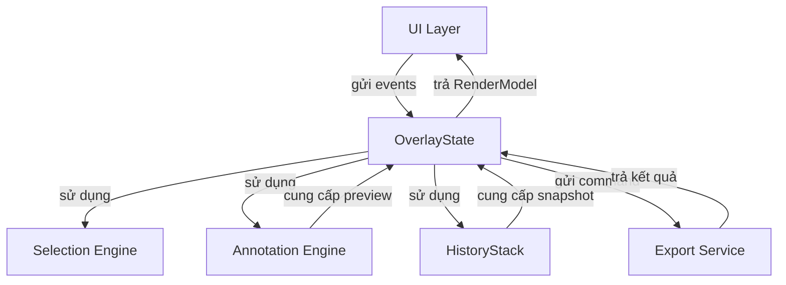

# Integration — Thiết kế chi tiết

> Tài liệu này mô tả cách OverlayState tích hợp với Selection, Annotation, History, Export, và UI layer trong F-Shot.

---

## 1. Mục đích

OverlayState là trung tâm điều phối, nhưng nó không tự mình tính toán hình học phức tạp, không vẽ, và không lưu file. Thay vào đó, nó tích hợp với các module chuyên trách khác thông qua các giao diện dữ liệu rõ ràng.

Mục tiêu là đảm bảo mỗi module chỉ làm một nhiệm vụ, dễ kiểm thử, và có thể thay thế riêng lẻ.

---

## 2. Tổng quan kiến trúc

Trong đó:

- UI Layer thu thập input và vẽ scene.
- OverlayState quyết định trạng thái và điều phối các module khác.
- Selection Engine tính toán vùng chọn, di chuyển, co giãn.
- Annotation Engine tạo và cập nhật preview annotation.
- HistoryStack lưu trữ các snapshot đã commit.
- Export Service thực hiện xuất ảnh theo target.

---

## 3. Tích hợp với Selection Engine

### 3.1 Trách nhiệm phân chia

- OverlayState quyết định khi nào bắt đầu tạo vùng chọn, khi nào di chuyển, khi nào co giãn.
- Selection Engine nhận điểm đầu vào, tính toán hình chữ nhật mới, clamp, và trả về kết quả.

### 3.2 Luồng tạo vùng chọn

1. Trong `Idle`, người dùng nhấn chuột. UI gửi `PointerPressed` đến OverlayState.
2. OverlayState chuyển sang `Selecting` và lưu điểm bắt đầu.
3. Khi chuột di chuyển, UI gửi `PointerMoved`.
4. OverlayState gọi Selection Engine với điểm bắt đầu và điểm hiện tại.
5. Selection Engine trả về hình chữ nhật tạm thời đã clamp.
6. OverlayState cập nhật RenderModel để vẽ vùng chọn tạm.
7. Khi thả chuột, Selection Engine kiểm tra kích thước tối thiểu. Nếu đủ lớn, OverlayState chuyển sang `Selected`.

### 3.3 Luồng di chuyển vùng chọn

1. Trong `Selected`, người dùng nhấn chuột trong vùng chọn.
2. OverlayState chuyển sang sub-state `MovingSelection`.
3. Khi chuột di chuyển, OverlayState gọi Selection Engine với điểm bắt đầu, offset, và điểm hiện tại.
4. Selection Engine tính vị trí mới của vùng chọn, đảm bảo không vượt ra ngoài phạm vi chụp.
5. OverlayState cập nhật RenderModel.

### 3.4 Luồng co giãn vùng chọn

1. Trong `Selected`, người dùng nhấn vào một điểm neo.
2. OverlayState chuyển sang sub-state `ResizingSelection`.
3. Khi chuột di chuyển, OverlayState gọi Selection Engine với điểm neo, vùng chọn ban đầu, và điểm hiện tại.
4. Selection Engine tính hình chữ nhật mới theo hướng co giãn.
5. OverlayState cập nhật RenderModel.

---

## 4. Tích hợp với Annotation Engine

### 4.1 Trách nhiệm phân chia

- OverlayState quyết định khi nào bắt đầu vẽ, khi nào commit, khi nào hủy.
- Annotation Engine nhận công cụ, style, điểm chuột, và tạo preview hoặc annotation hoàn chỉnh.

### 4.2 Luồng tạo preview

1. Trong `Selected`, người dùng chọn công cụ và nhấn chuột trong vùng chọn.
2. OverlayState chuyển sang `Annotating`.
3. OverlayState gọi Annotation Engine để tạo preview với điểm bắt đầu và công cụ đã chọn.
4. Khi chuột di chuyển, OverlayState gọi Annotation Engine để cập nhật preview.
5. Annotation Engine trả về preview mới với tham số hình học cập nhật.
6. OverlayState đưa preview vào RenderModel.

### 4.3 Luồng commit annotation

1. Khi người dùng thả chuột trong `Annotating`, OverlayState yêu cầu Annotation Engine chuyển preview thành annotation hoàn chỉnh.
2. Annotation Engine trả về annotation đã commit.
3. OverlayState lấy danh sách annotation từ `HistoryStack.Current`.
4. OverlayState tạo danh sách mới gồm các annotation cũ cộng annotation mới.
5. OverlayState tạo snapshot mới từ danh sách này.
6. OverlayState gọi `HistoryStack.Push`.
7. OverlayState quay về `Selected`.

### 4.4 Luồng hủy preview

1. Khi người dùng nhấn Esc trong `Annotating`, OverlayState xóa preview.
2. OverlayState không tạo snapshot mới.
3. OverlayState quay về `Selected`.

### 4.5 Luồng công cụ Text

1. Trong `Selected`, người dùng chọn công cụ Text và nhấn chuột trong vùng chọn.
2. OverlayState chuyển sang sub-state `EditingText`.
3. OverlayState yêu cầu UI hiển thị TextBox tạm tại vị trí đã chọn.
4. UI gửi nội dung text đang nhập về OverlayState qua các sự kiện cập nhật.
5. Khi nhấn Enter, OverlayState yêu cầu Annotation Engine tạo annotation Text.
6. OverlayState tạo snapshot mới và push vào HistoryStack.
7. OverlayState quay về `Selected`.

---

## 5. Tích hợp với HistoryStack

### 5.1 Trách nhiệm phân chia

- OverlayState sở hữu một `HistoryStack` trong suốt phiên chụp.
- OverlayState quyết định khi nào push, undo, redo.
- HistoryStack chỉ quản lý danh sách snapshot.

### 5.2 Khi nào Push

OverlayState gọi `HistoryStack.Push` trong các trường hợp sau:

- Sau khi commit một annotation mới.
- Sau khi xóa một annotation đã commit.
- Sau khi thay đổi thứ tự layer annotation trong v1.x.

Không Push trong các trường hợp sau:

- Di chuyển vùng chọn.
- Co giãn vùng chọn.
- Thay đổi công cụ hoặc style.
- Cập nhật preview.

### 5.3 Undo và Redo

Khi nhận sự kiện `Undo` hoặc `Redo`, OverlayState gọi phương thức tương ứng trên `HistoryStack`. Kết quả trả về snapshot mới làm trạng thái hiện tại. OverlayState cập nhật RenderModel để UI vẽ lại danh sách annotation theo snapshot mới.

Toolbar sử dụng `CanUndo` và `CanRedo` từ `HistoryStack` để bật/tắt các nút tương ứng.

---

## 6. Tích hợp với Export Service

### 6.1 Trách nhiệm phân chia

- OverlayState quyết định khi nào xuất và target xuất là gì.
- Export Service nhận screenshot, vùng chọn, danh sách annotation, và target, sau đó thực hiện xuất.

### 6.2 Luồng xuất ảnh

1. Trong `Selected` hoặc `Annotating`, người dùng nhấn `Ctrl+S` hoặc `Ctrl+C`.
2. OverlayState chuyển sang `Exporting`.
3. OverlayState gửi `ExportCommand` đến Export Service với đầy đủ dữ liệu cần thiết.
4. Export Service thực hiện xuất.
5. Khi hoàn tất, Export Service gửi `ExportCompleted` hoặc `ExportFailed` về OverlayState.
6. OverlayState chuyển sang `CloseOverlay` hoặc quay về `Selected` tùy kết quả và cấu hình.

### 6.3 Dữ liệu gửi đến Export Service

- Screenshot gốc.
- Vùng chọn.
- Danh sách annotation đã commit.
- Target: SaveToFile, CopyToClipboard, RawPngToStdout, v.v.
- Cấu hình bổ sung: đường dẫn lưu, định dạng, chất lượng.

---

## 7. Tích hợp với UI Layer

### 7.1 Trách nhiệm phân chia

- UI Layer thu thập tất cả input từ phần cứng và chuyển thành events có ngữ nghĩa.
- UI Layer nhận RenderModel và vẽ scene.
- UI Layer cũng thực hiện các commands từ OverlayState như đóng cửa sổ, hiển thị TextBox, hoặc gọi Export Service.

### 7.2 UI gửi events đến OverlayState

Các sự kiện UI gửi đến:

- `OpenOverlay` khi overlay mở.
- `PointerPressed`, `PointerMoved`, `PointerReleased` khi có tương tác chuột.
- `KeyDown` khi có phím bấm.
- `SelectTool`, `SetColor`, `SetStrokeWidth` khi người dùng tương tác với toolbar.
- `Undo`, `Redo`, `Copy`, `Save`, `Cancel` khi có phím tắt hoặc click nút.

### 7.3 UI nhận RenderModel từ OverlayState

Sau mỗi sự kiện, OverlayState trả về một kết quả gồm:

- RenderModel mới.
- Các commands cần thực hiện: `CloseOverlay`, `ShowTextBox`, `StartExport`, v.v.

UI Layer dùng RenderModel để vẽ lại scene và thực hiện các commands.

### 7.4 UI gửi kết quả ExportCompleted

Khi Export Service hoàn tất, UI Layer gửi `ExportCompleted` hoặc `ExportFailed` đến OverlayState để state machine chuyển trạng thái tiếp theo.

---

## 8. Tích hợp với Config

Config cung cấp các giá trị mặc định khi overlay mở:

- Công cụ mặc định.
- Màu sắc, độ dày nét, cỡ chữ.
- Giới hạn HistoryStack.
- Đường dẫn lưu file mặc định.

OverlayState lưu một bản sao cấu hình tại thời điểm mở. Việc thay đổi cấu hình trong lúc overlay đang mở không ảnh hưởng đến phiên chụp hiện tại.

---

## 9. Phạm vi trong MVP

Trong MVP, tích hợp cần đảm bảo:

- Selection Engine được gọi trong `Selecting`, `MovingSelection`, `ResizingSelection`.
- Annotation Engine được gọi trong `Annotating` và `EditingText`.
- HistoryStack được gọi Push sau mỗi commit annotation.
- HistoryStack được gọi Undo/Redo khi có phím tắt.
- Export Service được gọi khi có `Save` hoặc `Copy`.
- UI Layer gửi events đúng ngữ nghĩa và vẽ theo RenderModel.

Không cần trong MVP:

- Tích hợp với system tray.
- Tích hợp với global hotkeys.
- Tích hợp với config persistence trong lúc overlay đang mở.

---

## 10. Kết nối với các file thiết kế khác

- **08_02_States.md**: các trạng thái cần tích hợp với các module khác.
- **08_03_Events.md**: các sự kiện kích hoạt việc gọi module khác.
- **08_04_Transitions.md**: transitions mô tả khi nào gọi Selection, Annotation, History, Export.
- **08_05_RenderModel.md**: kết quả tổng hợp để UI vẽ.
- **05_03_HistoryStack.md**: quy tắc Push, Undo, Redo.
- **04_02_ToolModel.md**: các công cụ annotation dùng trong Annotation Engine.
- **06_02_ExportTarget.md**: các target xuất dùng trong Export Service.

---

*OverlayState đã được thiết kế đầy đủ từ states, events, transitions, render model đến tích hợp. Đây là nền tảng để triển khai `src/FShot.Core/State/OverlayState.fs` và kiểm thử `tests/FShot.Core.Tests/State/OverlayStateTests.fs` trong P1.03 và P1.04.*
