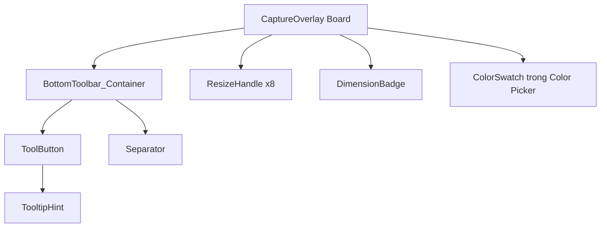

# UI/UX Mock Penpot — Common Components

> Trong Penpot (đặc biệt bản self-hosted hiện tại), Component được quản lý qua các **Properties** thay vì Variants truyền thống. Mỗi instance có thể override giá trị properties để thay đổi màu sắc, opacity.

Do đó, thiết kế component trong tài liệu này được mô tả theo cơ chế **Properties**. Với mỗi component, liệt kê:
- Các properties cần tạo.
- Giá trị mặc định.
- Giá trị override cho từng trạng thái (Default, Hover, Active, Disabled).

### Quy tắc đặt tên property

Sử dụng camelCase hoặc PascalCase, không dùng dấu chấm hay dấu gạch chéo vì Penpot có thể không hỗ trợ trong tên property.

Ví dụ:
- `Fill`
- `SelectedColor`
- `IconOpacity`
- `BorderColor`

### Cách binding với token

Properties không binding trực tiếp vào token trong Penpot. Thay vào đó, khi tạo property bạn nhập giá trị tương ứng token. Tài liệu này cung cấp bảng mapping giá trị để điền vào Penpot.

## Phân loại component

- **Bắt buộc cho Phase 1:** `ToolButton`, `BottomToolbar_Container`, `ResizeHandle`, `DimensionBadge`.
- **Phụ trợ:** `ColorSwatch` (dùng cho Color Picker Popup), `TooltipHint` (nice-to-have, không bắt buộc MVP).
- **Không phải component Penpot:** icon SVG. Đây là tài nguyên vector import vào bên trong `ToolButton`.

---

## 1. Component `ToolButton`

### 1.1. Mục đích

`ToolButton` là nút vuông dùng để chọn công cụ hoặc thực hiện hành động. Nó là phần tử nhỏ nhất trong toolbar.

### 1.2. Cấu trúc layer

```text
ToolButton (Board 32×32px)
└── ToolButton_Background (Rectangle 32×32px, bo góc 6px)
    └── ToolButton_Icon (SVG 18×18px, vector, căn giữa)
```

### 1.3. Properties của ToolButton

Penpot self-hosted gộp màu và opacity thành một color property duy nhất. Do đó `ToolButton` chỉ cần 2 properties:

| Property | Áp dụng cho | Mô tả |
| :--- | :--- | :--- |
| `Fill` | `ToolButton_Background` | Màu nền + opacity của nút. Penpot lưu cả hai trong cùng property. |
| `IconColor` | `ToolButton_Icon` | Màu icon + opacity của icon. Penpot lưu cả hai trong cùng property. |

**Lưu ý:** Không tạo `FillOpacity` riêng. Khi thay đổi opacity của `Fill`, nó chỉ ảnh hưởng đến layer Background. Nếu bạn thấy opacity của `IconColor` cũng đổi theo, đó là do bạn đang dùng chung property hoặc Penpot đã gộp hai layer vào cùng property. Kiểm tra lại tên property của từng layer để đảm bảo tách biệt.

### 1.4. Giá trị properties theo trạng thái

| Trạng thái | `Fill` | `IconColor` |
| :--- | :--- | :--- |
| Default | `#FFFFFF` opacity `0` | `#FFFFFF` opacity `0.85` |
| Hover | `#FFFFFF` opacity `0.12` | `#FFFFFF` opacity `1.00` |
| Active | `#7C3AED` opacity `1.00` | `#FFFFFF` opacity `1.00` |
| Disabled | `#FFFFFF` opacity `0` | `#FFFFFF` opacity `0.35` |

Cột `Fill` bao gồm cả mã màu và opacity. Cột `IconColor` cũng vậy.

### 1.5. Mapping với token

| Property | Trạng thái | Giá trị điền vào Penpot | Token tương ứng |
| :--- | :--- | :--- | :--- |
| `Fill` | Default | `#FFFFFF` opacity `0` | `ToolButton.Default.Background` + opacity `0` |
| `IconColor` | Default | `#FFFFFF` opacity `0.85` | `ToolButton.Default.IconColor` + `ToolButton.Default.IconOpacity` |
| `Fill` | Hover | `#FFFFFF` opacity `0.12` | `ToolButton.Hover.Background` + `ToolButton.Hover.BackgroundOpacity` |
| `IconColor` | Hover | `#FFFFFF` opacity `1.00` | `ToolButton.Hover.IconColor` + `ToolButton.Hover.IconOpacity` |
| `Fill` | Active | `#7C3AED` opacity `1.00` | `ToolButton.Active.Background` + `ToolButton.Active.BackgroundOpacity` |
| `IconColor` | Active | `#FFFFFF` opacity `1.00` | `ToolButton.Active.IconColor` + `ToolButton.Active.IconOpacity` |
| `Fill` | Disabled | `#FFFFFF` opacity `0` | `ToolButton.Disabled.Background` + opacity `0` |
| `IconColor` | Disabled | `#FFFFFF` opacity `0.35` | `ToolButton.Disabled.IconColor` + `ToolButton.Disabled.IconOpacity` |

### 1.6. Cách tạo trong Penpot

Bước 1: Tạo Board `32 × 32px` tên `ToolButton`.

Bước 2: Vẽ Rectangle `32 × 32px` tên `ToolButton_Background`, bo góc `Radius.ToolButton = 6px`.

Bước 3: Import SVG icon `18 × 18px`, đặt tên `ToolButton_Icon`, căn giữa trong Board.

Bước 4: Chọn Board → `Ctrl+K` tạo component.

Bước 5: Chọn `ToolButton_Background`, tạo property tên `Fill` từ fill hiện tại. Giá trị mặc định: `#FFFFFF` opacity `0`.

Bước 6: Chọn `ToolButton_Icon`, tạo property tên `IconColor` từ fill hiện tại. Giá trị mặc định: `#FFFFFF` opacity `0.85`.

Bước 7: Kiểm tra panel properties của component. Phải thấy 2 properties riêng biệt: `Fill` và `IconColor`. Nếu thấy tên khác hoặc chỉ có 1 property, kiểm tra lại việc tạo property từ đúng layer.

### 1.7. Khi dùng instance

Mỗi instance của `ToolButton` sẽ có 2 ô properties ở panel bên phải. Bạn nhập giá trị tương ứng trạng thái:

- Nút chưa chọn: `Fill = #FFFFFF opacity 0`, `IconColor = #FFFFFF opacity 0.85`.
- Nút hover: `Fill = #FFFFFF opacity 0.12`, `IconColor = #FFFFFF opacity 1.00`.
- Nút active: `Fill = #7C3AED opacity 1.00`, `IconColor = #FFFFFF opacity 1.00`.
- Nút disabled: `Fill = #FFFFFF opacity 0`, `IconColor = #FFFFFF opacity 0.35`.

---

## 2. Component `BottomToolbar_Container`

### 2.1. Mục đích

`BottomToolbar_Container` là vỏ bọc nền chứa toàn bộ `ToolButton`. Nó nổi sát mép dưới vùng chọn.

### 2.2. Cấu trúc layer

```text
BottomToolbar_Container (auto-width × 40px)
├── Background (nền tối, bo góc 8px, viền 1px mờ, shadow 12px blur)
├── FlexGroup_Horizontal
│   ├── Group_AnnotationTools
│   │   ├── ToolButton_Pencil
│   │   ├── ToolButton_Line
│   │   ├── ToolButton_Arrow
│   │   ├── ToolButton_Rectangle
│   │   ├── ToolButton_Circle
│   │   ├── ToolButton_Marker
│   │   ├── ToolButton_Text
│   │   └── ToolButton_Pixelate
│   ├── Separator (1×20px, màu trắng 15% opacity)
│   └── Group_ActionTools
│       ├── ToolButton_Undo
│       ├── ToolButton_Redo
│       ├── ToolButton_Copy
│       ├── ToolButton_Save
│       └── ToolButton_Cancel
```

### 2.3. Layout chi tiết

- Chiều cao cố định: `40px`.
- Chiều rộng tự động theo số lượng nút.
- Padding ngang: `Spacing.Toolbar.PaddingX = 8px`; padding dọc: `Spacing.Toolbar.PaddingY = 4px`.
- Khoảng cách giữa các nút trong cùng nhóm: `Spacing.Toolbar.InnerGap = 4px`.
- Khoảng cách giữa hai nhóm qua separator: `Spacing.Toolbar.GroupGap = 8px` tính từ mép nút cuối nhóm 1 đến separator, và `8px` từ separator đến nút đầu nhóm 2.
- Separator là hình chữ nhật đứng `1px × 20px`, căn giữa theo chiều dọc trong toolbar.
- Các ToolButton instance bên trong là instance của component `ToolButton`, mỗi instance override properties theo trạng thái.

### 2.4. Góc cạnh và bóng đổ

- Bo góc `8px`.
- Viền ngoài `1px`, màu trắng `10%` opacity.
- Shadow: màu đen `40%` opacity, blur `12px`, offsetY `4px`, không offsetX.

### 2.5. Hành vi responsive

Khi vùng chọn nằm gần cạnh màn hình:

- Nếu toolbar vượt quá biên phải màn hình, dịch chuyển sang trái để vừa vặn.
- Nếu vùng chọn ở sát biên dưới màn hình, toolbar hiển thị ở mép trên vùng chọn thay vì mép dưới.
- Khoảng cách tối thiểu từ toolbar đến biên màn hình: `8px`.

Trong Penpot, hành vi responsive không thể thể hiện bằng prototype. Thiết kế tĩnh nên có thêm một board phụ `Toolbar_Positioning_Grid` minh họa 4 trường hợp đặt toolbar: bình thường, sát phải, sát dưới, góc dưới-phải.

---

## 3. Component `ResizeHandle`

### 3.1. Mục đích

`ResizeHandle` là điểm neo vuông nhỏ xuất hiện quanh vùng chọn khi đã hoàn tất. Dùng để bắt chuột co giãn.

### 3.2. Cấu trúc layer

```text
ResizeHandle (Board 16×16px)
├── ResizeHandle_VisibleSquare (Rectangle 8×8px, fill cyan, stroke đen 1px, căn giữa Board)
└── ResizeHandle_HitTestArea (Rectangle 16×16px, trong suốt, nằm dưới VisibleSquare hoặc phía trên)
```

Lưu ý: `HitTestArea` là hình chữ nhật trong suốt full Board để designer thấy vùng bắt chuột. Layer này không hiển thị khi render.

### 3.3. Properties của ResizeHandle

| Property | Áp dụng cho | Mô tả |
| :--- | :--- | :--- |
| `FillColor` | `ResizeHandle_VisibleSquare` | Màu nền + opacity của hình vuông hiển thị. |
| `StrokeColor` | `ResizeHandle_VisibleSquare` | Màu viền + opacity. |
| `StrokeWidth` | `ResizeHandle_VisibleSquare` | Độ dày viền. |

### 3.4. Giá trị mặc định

| Property | Giá trị điền vào Penpot | Token tương ứng |
| :--- | :--- | :--- |
| `FillColor` | `#00E5FF` opacity `1.00` | `Handle.FillColor` + `Handle.FillOpacity` |
| `StrokeColor` | `#000000` opacity `1.00` | `Handle.StrokeColor` + `Handle.StrokeOpacity` |
| `StrokeWidth` | `1px` | `Handle.StrokeWidth` |

### 3.4. Vị trí 8 handle

Gọi vùng chọn là `R` với `Left = R.X`, `Top = R.Y`, `Right = R.X + R.Width`, `Bottom = R.Y + R.Height`. Tọa độ tâm của 8 handle:

| Handle | Tọa độ tâm (CenterX, CenterY) |
| :--- | :--- |
| TopLeft | `(R.Left, R.Top)` |
| TopCenter | `(R.Left + R.Width / 2, R.Top)` |
| TopRight | `(R.Right, R.Top)` |
| MiddleLeft | `(R.Left, R.Top + R.Height / 2)` |
| MiddleRight | `(R.Right, R.Top + R.Height / 2)` |
| BottomLeft | `(R.Left, R.Bottom)` |
| BottomCenter | `(R.Left + R.Width / 2, R.Bottom)` |
| BottomRight | `(R.Right, R.Bottom)` |

Mỗi handle được vẽ sao cho tâm của nó trùng với tọa độ trên. Do kích thước hiển thị là `8 × 8px`, góc trên-trái của hình vuông hiển thị sẽ lệch `-4px` so với tâm.

### 3.5. Cursor tương ứng

| Handle | Con trỏ chuột |
| :--- | :--- |
| TopLeft, BottomRight | `nwse-resize` |
| TopRight, BottomLeft | `nesw-resize` |
| TopCenter, BottomCenter | `ns-resize` |
| MiddleLeft, MiddleRight | `ew-resize` |

---

## 4. Component `DimensionBadge`

### 4.1. Mục đích

`DimensionBadge` hiển thị kích thước vùng chọn `Width × Height` hoặc `Width × Height + X + Y` khi đang kéo hoặc co giãn.

### 4.2. Cấu trúc layer

```text
DimensionBadge (Board auto-width × 18px)
├── DimensionBadge_Background (Rectangle full Board, bo góc 4px)
└── DimensionBadge_Text (Text 11px, màu trắng, weight 600)
```

### 4.3. Properties của DimensionBadge

| Property | Áp dụng cho | Mô tả |
| :--- | :--- | :--- |
| `BackgroundColor` | `DimensionBadge_Background` | Màu nền + opacity của badge. |
| `TextColor` | `DimensionBadge_Text` | Màu chữ + opacity. |

### 4.4. Giá trị mặc định

| Property | Giá trị điền vào Penpot | Token tương ứng |
| :--- | :--- | :--- |
| `BackgroundColor` | `#7C3AED` opacity `0.95` | `Badge.BackgroundColor` + `Badge.BackgroundOpacity` |
| `TextColor` | `#FFFFFF` opacity `1.00` | `Badge.TextColor` + `Badge.TextOpacity` |

### 4.5. Nội dung văn bản

- Khi đang kéo tạo vùng chọn hoặc resize: `"{Width} × {Height}"`.
- Khi đã chọn xong và cần thông tin đầy đủ (tùy chọn): `"{Width} × {Height} @ {X},{Y}"`.
- Font: `Text.FontFamily`, size `Text.Badge.FontSize`, weight `Text.Weight.Semibold`.

### 4.4. Vị trí

- Mặc định đặt ở góc trên-phải của vùng chọn.
- Khoảng cách từ góc vùng chọn: `4px` về phía trên và `4px` về phía phải.
- Nếu vùng chọn nằm sát biên trên màn hình, badge chuyển xuống góc dưới-phải.
- Padding ngang: `6px`, padding dọc: `2px`.

---

## 5. Component `ColorSwatch`

### 5.1. Mục đích

`ColorSwatch` là ô màu tròn nhỏ trong popup chọn màu hoặc palette công cụ. Dùng để xem trước màu annotation đang chọn.

### 5.2. Cấu trúc layer

```text
ColorSwatch (20×20px, hình tròn)
├── FillCircle (18×18px, màu annotation)
└── OuterRing (20×20px, viền trắng 1px, hiển thị khi swatch đang active)
```

### 5.3. Properties của ColorSwatch

| Property | Áp dụng cho | Mô tả |
| :--- | :--- | :--- |
| `FillColor` | `ColorSwatch_FillCircle` | Màu của ô màu. |
| `RingOpacity` | `ColorSwatch_OuterRing` | Độ đục viền active. |

### 5.4. Giá trị mặc định

| Trạng thái | `FillColor` | `RingOpacity` |
| :--- | :--- | :--- |
| Default | `Annotation.Red` opacity `1.00` | viền trắng `0.30` |
| Hover | `Annotation.Red` opacity `1.00` + overlay trắng `0.10` | viền trắng `0.50` |
| Active | `Annotation.Red` opacity `1.00` | viền trắng `1.00` |

---

## 6. Component `TooltipHint`

### 6.1. Mục đích

`TooltipHint` là nhãn nhỏ hiển thị tên công cụ và phím tắt khi hover lâu vào `ToolButton`. Không bắt buộc trong MVP nhưng nên thiết kế sẵn.

### 6.2. Cấu trúc layer

```text
TooltipHint (auto-width × 24px)
├── Background (nền đen `#000000`, opacity 0.85, bo góc 4px)
└── Text (13px, trắng)
```

### 6.3. Nội dung

Dạng `"Tên công cụ (Shortcut)"`, ví dụ `"Bút vẽ (P)"`.

---

## 7. Quan hệ giữa các component



---

## 8. Quy tắc đặt tên layer trong Penpot

Mỗi component Master trong Penpot nên có cấu trúc layer thống nhất để dễ tìm và override. Quy tắc đặt tên:

```text
{ComponentName}_{Role}_{Element}
```

Ví dụ:

- `ToolButton_Container_Background`
- `ToolButton_Container_Icon`
- `BottomToolbar_Background`
- `BottomToolbar_Separator`
- `ResizeHandle_VisibleSquare`
- `ResizeHandle_HitTestArea`
- `DimensionBadge_Background`
- `DimensionBadge_Text`

Layer nền luôn đặt ở dưới cùng. Layer tương tác hoặc hit-test trong suốt đặt ở trên cùng. Icon, text, badge nằm giữa.

---

## 9. Checklist tạo từng component trong Penpot

### 9.1. Tạo `ToolButton`

Bước 1: Tạo Board mới tên `ToolButton`, kích thước `32 × 32px`.

Bước 2: Vẽ Rectangle `32 × 32px` tên `ToolButton_Container_Background`, bo góc `Radius.ToolButton = 6px`.

Bước 3: Gán fill:
- Variant Default: `ToolButton.Default.Background` với opacity `0`.
- Variant Hover: `ToolButton.Hover.Background` với opacity `0.12`.
- Variant Active: `ToolButton.Active.Background` với opacity `1`.
- Variant Disabled: `ToolButton.Disabled.Background` với opacity `0`.

Bước 4: Import SVG icon `18 × 18px`, đặt tên `ToolButton_Container_Icon`, căn giữa trong Board. Màu icon binding về `ToolButton.{Variant}.IconColor`, opacity binding về `ToolButton.{Variant}.IconOpacity`.

Bước 5: Tạo 4 Variants: `Default`, `Hover`, `Active`, `Disabled`.

Bước 6: Đảm bảo mỗi variant chỉ thay đổi fill background và opacity icon, không thay đổi kích thước board.

### 9.2. Tạo `BottomToolbar_Container`

Bước 1: Tạo Board mới tên `BottomToolbar_Container`, chiều cao `40px`, chiều rộng tự động (`Hug content`).

Bước 2: Vẽ Rectangle nền tên `BottomToolbar_Background`, kích thước full board, bo góc `Radius.Toolbar = 8px`.

Bước 3: Gán fill `Toolbar.BackgroundColor` với opacity `Toolbar.BackgroundOpacity`.

Bước 4: Thêm stroke `1px`, màu `Toolbar.BorderColor`, opacity `Toolbar.BorderOpacity`.

Bước 5: Thêm shadow: màu `Toolbar.ShadowColor`, opacity `Toolbar.ShadowOpacity`, blur `Toolbar.ShadowBlur`, offsetY `Toolbar.ShadowOffsetY`.

Bước 6: Tạo Flex Layout ngang tên `BottomToolbar_FlexGroup`:
- Direction: Row.
- Align items: Center.
- Gap giữa các phần tử: tính theo `Spacing.Toolbar.InnerGap` và `Spacing.Toolbar.GroupGap`.
- Padding: `Spacing.Toolbar.PaddingX` ngang, `Spacing.Toolbar.PaddingY` dọc.

Bước 7: Tạo nhóm `Group_AnnotationTools`, thêm 8 instance của `ToolButton`. Mỗi instance override properties theo trạng thái Default.

Bước 8: Tạo Separator: Rectangle `1 × 20px` tên `BottomToolbar_Separator`, màu `Toolbar.SeparatorColor`, opacity `Toolbar.SeparatorOpacity`.

Bước 9: Tạo nhóm `Group_ActionTools`, thêm 5 instance của `ToolButton`. Mỗi instance override properties theo trạng thái Default.

Bước 10: Đảm bảo khoảng cách giữa 2 nhóm qua separator là `2 × Spacing.Toolbar.GroupGap + Toolbar.SeparatorWidth`.

### 9.3. Tạo `ResizeHandle`

Bước 1: Tạo Board `16 × 16px` tên `ResizeHandle`.

Bước 2: Vẽ Rectangle `8 × 8px` tên `ResizeHandle_VisibleSquare`, căn giữa trong Board.

Bước 3: Fill `Handle.FillColor` với opacity `Handle.FillOpacity`.

Bước 4: Stroke `Handle.StrokeWidth`, màu `Handle.StrokeColor`, opacity `Handle.StrokeOpacity`.

Bước 5: (Tùy chọn) Vẽ Rectangle `16 × 16px` tên `ResizeHandle_HitTestArea`, trong suốt hoàn toàn. Layer này giúp designer thấy vùng bắt chuột.

Bước 6: Chọn Board → `Ctrl+K` tạo component.

Bước 7: Tạo các properties: `FillColor`, `StrokeColor`, `StrokeWidth` với giá trị mặc định theo token.

### 9.4. Tạo `DimensionBadge`

Bước 1: Tạo Board tên `DimensionBadge`, chiều cao `Size.Badge.Height = 18px`, chiều rộng tự động.

Bước 2: Vẽ Rectangle nền tên `DimensionBadge_Background`, bo góc `Radius.Badge = 4px`.

Bước 3: Fill `Badge.BackgroundColor` với opacity `Badge.BackgroundOpacity`.

Bước 4: Thêm Text tên `DimensionBadge_Text`, nội dung mẫu `"800 × 500"`.

Bước 5: Font: `Text.FontFamily`, size `Text.Badge.FontSize`, weight `Text.Weight.Semibold`, màu `Badge.TextColor`, opacity `Badge.TextOpacity`.

Bước 6: Padding ngang `Size.Badge.PaddingX`, padding dọc `Size.Badge.PaddingY`.

Bước 7: Chọn Board → `Ctrl+K` tạo component.

Bước 8: Tạo properties: `BackgroundColor`, `TextColor`. Mỗi property bao gồm cả màu và opacity. Không cần tạo property opacity riêng.

### 9.5. Tạo `ColorSwatch`

Bước 1: Tạo Board `20 × 20px` tên `ColorSwatch`.

Bước 2: Vẽ Ellipse `18 × 18px` tên `ColorSwatch_FillCircle`, căn giữa.

Bước 3: Fill binding về `Annotation.Red` (hoặc màu annotation tương ứng).

Bước 4: Vẽ Ellipse `20 × 20px` tên `ColorSwatch_OuterRing`, nằm dưới FillCircle, màu trắng opacity `0.30`.

Bước 5: Chọn Board → `Ctrl+K` tạo component.

Bước 8: Tạo properties: `FillColor`, `RingOpacity`. `FillColor` bao gồm cả màu và opacity; `RingOpacity` là độ đục của viền trắng.

Bước 7: Khi dùng instance, override `FillColor` theo màu mong muốn.

---

## 10. Bảng binding property cho từng component

| Component | Layer | Property | Giá trị mặc định điền vào Penpot | Token tương ứng |
| :--- | :--- | :--- | :--- | :--- |
| `ToolButton` | Background | `Fill` | `#FFFFFF` opacity `0` | `ToolButton.Default.Background` + opacity `0` |
| `ToolButton` | Icon | `IconColor` | `#FFFFFF` opacity `0.85` | `ToolButton.Default.IconColor` + `ToolButton.Default.IconOpacity` |
| `BottomToolbar` | Background | Fill | `#1E1E2E` opacity `0.95` | `Toolbar.BackgroundColor` + `Toolbar.BackgroundOpacity` |
| `BottomToolbar` | Background | Stroke | `#FFFFFF` opacity `0.10`, width `1px` | `Toolbar.BorderColor` + `Toolbar.BorderOpacity` + `Toolbar.BorderWidth` |
| `BottomToolbar` | Background | Shadow | `#000000` opacity `0.40`, blur `12px`, offsetY `4px` | `Toolbar.ShadowColor` + `Toolbar.ShadowOpacity` + `Toolbar.ShadowBlur` + `Toolbar.ShadowOffsetY` |
| `BottomToolbar` | Separator | Fill | `#FFFFFF` opacity `0.15` | `Toolbar.SeparatorColor` + `Toolbar.SeparatorOpacity` |
| `ResizeHandle` | VisibleSquare | `FillColor` | `#00E5FF` opacity `1.00` | `Handle.FillColor` + `Handle.FillOpacity` |
| `ResizeHandle` | VisibleSquare | `StrokeColor` | `#000000` opacity `1.00`, width `1px` | `Handle.StrokeColor` + `Handle.StrokeOpacity` + `Handle.StrokeWidth` |
| `DimensionBadge` | Background | `BackgroundColor` | `#7C3AED` opacity `0.95` | `Badge.BackgroundColor` + `Badge.BackgroundOpacity` |
| `DimensionBadge` | Text | `TextColor` | `#FFFFFF` opacity `1.00` | `Badge.TextColor` + `Badge.TextOpacity` |
| `ColorSwatch` | FillCircle | `FillColor` | `#EF4444` opacity `1.00` | `Annotation.Red` |
| `ColorSwatch` | OuterRing | `RingOpacity` | trắng opacity `0.30` | - |

## 11. Override properties cho từng trạng thái ToolButton

Khi kéo instance ToolButton vào Board màn hình, nhập giá trị 2 properties `Fill` và `IconColor` theo bảng sau. Mỗi property đã bao gồm cả màu và opacity.

| Trạng thái | `Fill` | `IconColor` |
| :--- | :--- | :--- |
| Default | `#FFFFFF` opacity `0` | `#FFFFFF` opacity `0.85` |
| Hover | `#FFFFFF` opacity `0.12` | `#FFFFFF` opacity `1.00` |
| Active | `#7C3AED` opacity `1.00` | `#FFFFFF` opacity `1.00` |
| Disabled | `#FFFFFF` opacity `0` | `#FFFFFF` opacity `0.35` |

**Lưu ý về Penpot:** Khi property là color, Penpot tự động gộp mã màu và opacity. Nếu bạn thấy đổi opacity của một property mà property khác cũng đổi theo, đó là do hai property đang dùng chung layer hoặc tên property trùng nhau. Kiểm tra lại tên property của từng layer để đảm bảo tách biệt.

---

## 11. Yêu cầu icon SVG cho ToolButton

Mỗi icon trong toolbar phải là vector `18 × 18px`, viewBox `0 0 18 18`. Danh sách icon cần thiết:

| Nút | Tên file | Mô tả hình dạng |
| :--- | :--- | :--- |
| Pencil | `icon_pencil.svg` | Nét cong tự do hoặc hình bút chì. |
| Line | `icon_line.svg` | Đường thẳng nghiêng 45°. |
| Arrow | `icon_arrow.svg` | Đường thẳng với mũi tên. |
| Rectangle | `icon_rectangle.svg` | Hình chữ nhật rỗng. |
| Circle | `icon_circle.svg` | Hình tròn / elip rỗng. |
| Marker | `icon_marker.svg` | Nét ngang bán trong suốt. |
| Text | `icon_text.svg` | Chữ `T`. |
| Pixelate | `icon_pixelate.svg` | Lưới ô vuông. |
| Undo | `icon_undo.svg` | Mũi tên cong trái. |
| Redo | `icon_redo.svg` | Mũi tên cong phải. |
| Copy | `icon_copy.svg` | Hai tờ giấy chồng lệch. |
| Save | `icon_save.svg` | Đĩa mềm hoặc mũi tên xuống. |
| Cancel | `icon_cancel.svg` | Dấu `X`. |

Tất cả icon dùng `currentColor` để trong Avalonia có thể đổi màu qua `Foreground`.

## 13. Workflow tạo Component trong Penpot (quan trọng)

Trong Penpot self-hosted hiện tại, Component được quản lý qua **Properties** thay vì Variants truyền thống. Workflow chuẩn:

### Bước 1: Tạo Board
- Trên Page `00_CommonComponent`, chọn **Board tool** hoặc nhấn `B`.
- Vẽ Board với kích thước chuẩn.
- Đặt tên Board theo component, ví dụ `ToolButton`, `ResizeHandle`.

### Bước 2: Vẽ layer bên trong Board
- Thêm các layer cần thiết: Background rectangle, Icon SVG, Text, Ellipse.
- Gán fill/stroke/text bằng giá trị từ token.
- Đặt tên layer theo quy tắc ở mục 8.

### Bước 3: Chuyển Board thành Component
- Click chọn **Board ngoài cùng** (không chọn layer con).
- Nhấn `Ctrl + K` hoặc right-click → **Create component**.
- Board bây giờ là **Main Component**, hiển thị viền tím.

### Bước 4: Tạo Properties
- Chọn từng layer con trong Board component.
- Ở panel bên phải, tìm mục **Properties**.
- Click **Add property** hoặc biểu tượng `+` cạnh Fill/Stroke/Text.
- Đặt tên property theo bảng binding trong mục 10.
- Nhập giá trị mặc định tương ứng token.

### Bước 5: Override properties trên Instance
- Sang Page `01_CaptureOverlay`, mở tab **Components** ở sidebar trái.
- Kéo component từ thư viện vào Board màn hình.
- Click chọn instance vừa kéo.
- Ở panel bên phải, bạn sẽ thấy các properties đã tạo.
- Nhập giá trị override theo trạng thái (Default, Hover, Active, Disabled).

### Lưu ý quan trọng
- Nếu double-click vào instance, Penpot đưa bạn vào **component edit mode**. Breadcrumb sẽ hiển thị `Page > Component`. Để thoát, click vào tên Page trong breadcrumb hoặc nhấn `Esc` nhiều lần.
- Khi đang ở component edit mode, `Ctrl+K` không tạo component mới mà chỉ thêm object vào component đang edit.
- Luôn đảm bảo ở ngoài Page trước khi tạo component mới.
- Penpot self-hosted có thể gọi properties với tên khác nhau (ví dụ `Fill`, `Selected Color`). Tên trong tài liệu là gợi ý; bạn có thể đặt tên tương tự nhưng phải nhất quán trong cùng một component.

- Mỗi component Master nên được đặt trong Board riêng với kích thước chuẩn, ví dụ `ToolButton` trong Board `32 × 32px`.
- Dùng **Variants** của Penpot để quản lý Default / Hover / Active / Disabled.
- Không gộp nhiều trạng thái vào cùng một layer; tách rõ các layer nền, icon, label.
- Icon nên là vector SVG đơn giản, không raster, để dễ export.
- `ResizeHandle` cần tách lớp `HitTestArea` trong suốt riêng với `VisibleSquare` để designer và developer cùng hiểu vùng bắt chuột.
- Khi tạo instance trong Board trạng thái, nhớ chọn đúng variant của component. Ví dụ trong Board `State_04_Annotating_Mode`, nút Pencil phải dùng variant `Active`.
- Không hardcode màu hay kích thước trong component; tất cả binding về token đã import từ `fshot_tokens.json`. Nếu token thay đổi, toàn bộ component tự động cập nhật.
