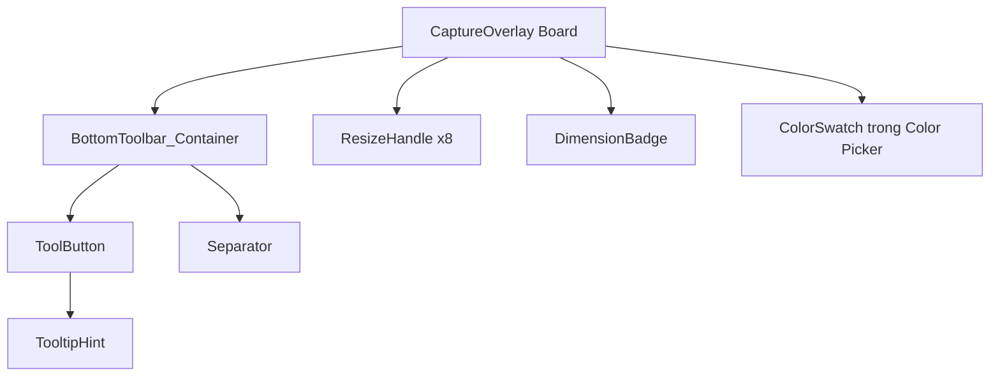

# UI/UX Mock Penpot — Common Components

> Trong Penpot (đặc biệt bản self-hosted hiện tại), Component được quản lý qua các **Properties** thay vì Variants truyền thống. Mỗi instance có thể override giá trị properties để thay đổi màu sắc, opacity.

Do đó, thiết kế component trong tài liệu này được mô tả theo cơ chế **Properties**. Với mỗi component, liệt kê:
- Các properties cần tạo.
- Giá trị mặc định.
- Giá trị override cho từng trạng thái (Default, Hover, Active, Disabled).

### Quy tắc đặt tên property

Sử dụng camelCase hoặc PascalCase, không dùng dấu chấm hay dấu gạch chéo vì Penpot có thể không hỗ trợ trong tên property.

Ví dụ:
- `Fill`
- `SelectedColor`
- `IconOpacity`
- `BorderColor`

### Cách binding với token

Properties không binding trực tiếp vào token trong Penpot. Thay vào đó, khi tạo property bạn nhập giá trị tương ứng token. Tài liệu này cung cấp bảng mapping giá trị để điền vào Penpot.

## Phân loại component

- **Bắt buộc cho Phase 1:** `ToolButton`, `BottomToolbar_Container`, `ResizeHandle`, `DimensionBadge`.
- **Phụ trợ:** `ColorSwatch` (dùng cho Color Picker Popup), `TooltipHint` (nice-to-have, không bắt buộc MVP).
- **Không phải component Penpot:** icon SVG. Đây là tài nguyên vector import vào bên trong `ToolButton`.

---

## 1. Component `ToolButton`

### 1.1. Mục đích

`ToolButton` là nút vuông dùng để chọn công cụ hoặc thực hiện hành động. Nó là phần tử nhỏ nhất trong toolbar.

### 1.2. Cấu trúc layer

```text
ToolButton (Board 32×32px)
└── ToolButton_Background (Rectangle 32×32px, bo góc 6px)
    └── ToolButton_Icon (SVG 18×18px, vector, căn giữa)
```

### 1.3. Properties của ToolButton

Penpot self-hosted gộp màu và opacity thành một color property duy nhất. Do đó `ToolButton` chỉ cần 2 properties:

| Property | Áp dụng cho | Mô tả |
| :--- | :--- | :--- |
| `Fill` | `ToolButton_Background` | Màu nền + opacity của nút. Penpot lưu cả hai trong cùng property. |
| `IconColor` | `ToolButton_Icon` | Màu icon + opacity của icon. Penpot lưu cả hai trong cùng property. |

**Lưu ý:** Không tạo `FillOpacity` riêng. Khi thay đổi opacity của `Fill`, nó chỉ ảnh hưởng đến layer Background. Nếu bạn thấy opacity của `IconColor` cũng đổi theo, đó là do bạn đang dùng chung property hoặc Penpot đã gộp hai layer vào cùng property. Kiểm tra lại tên property của từng layer để đảm bảo tách biệt.

### 1.4. Giá trị properties theo trạng thái

| Trạng thái | `Fill` | `IconColor` |
| :--- | :--- | :--- |
| Default | `#FFFFFF` opacity `0` | `#FFFFFF` opacity `0.85` |
| Hover | `#FFFFFF` opacity `0.12` | `#FFFFFF` opacity `1.00` |
| Active | `#7C3AED` opacity `1.00` | `#FFFFFF` opacity `1.00` |
| Disabled | `#FFFFFF` opacity `0` | `#FFFFFF` opacity `0.35` |

Cột `Fill` bao gồm cả mã màu và opacity. Cột `IconColor` cũng vậy.

### 1.5. Mapping với token

| Property | Trạng thái | Giá trị điền vào Penpot | Token tương ứng |
| :--- | :--- | :--- | :--- |
| `Fill` | Default | `#FFFFFF` opacity `0` | `ToolButton.Default.Background` + opacity `0` |
| `IconColor` | Default | `#FFFFFF` opacity `0.85` | `ToolButton.Default.IconColor` + `ToolButton.Default.IconOpacity` |
| `Fill` | Hover | `#FFFFFF` opacity `0.12` | `ToolButton.Hover.Background` + `ToolButton.Hover.BackgroundOpacity` |
| `IconColor` | Hover | `#FFFFFF` opacity `1.00` | `ToolButton.Hover.IconColor` + `ToolButton.Hover.IconOpacity` |
| `Fill` | Active | `#7C3AED` opacity `1.00` | `ToolButton.Active.Background` + `ToolButton.Active.BackgroundOpacity` |
| `IconColor` | Active | `#FFFFFF` opacity `1.00` | `ToolButton.Active.IconColor` + `ToolButton.Active.IconOpacity` |
| `Fill` | Disabled | `#FFFFFF` opacity `0` | `ToolButton.Disabled.Background` + opacity `0` |
| `IconColor` | Disabled | `#FFFFFF` opacity `0.35` | `ToolButton.Disabled.IconColor` + `ToolButton.Disabled.IconOpacity` |

### 1.6. Cách tạo trong Penpot

Bước 1: Tạo Board `32 × 32px` tên `ToolButton`.

Bước 2: Vẽ Rectangle `32 × 32px` tên `ToolButton_Background`, bo góc `Radius.ToolButton = 6px`.

Bước 3: Import SVG icon `18 × 18px`, đặt tên `ToolButton_Icon`, căn giữa trong Board.

Bước 4: Chọn Board → `Ctrl+K` tạo component.

Bước 5: Chọn `ToolButton_Background`, tạo property tên `Fill` từ fill hiện tại. Giá trị mặc định: `#FFFFFF` opacity `0`.

Bước 6: Chọn `ToolButton_Icon`, tạo property tên `IconColor` từ fill hiện tại. Giá trị mặc định: `#FFFFFF` opacity `0.85`.

Bước 7: Kiểm tra panel properties của component. Phải thấy 2 properties riêng biệt: `Fill` và `IconColor`. Nếu thấy tên khác hoặc chỉ có 1 property, kiểm tra lại việc tạo property từ đúng layer.

### 1.7. Khi dùng instance

Mỗi instance của `ToolButton` sẽ có 2 ô properties ở panel bên phải. Bạn nhập giá trị tương ứng trạng thái:

- Nút chưa chọn: `Fill = #FFFFFF opacity 0`, `IconColor = #FFFFFF opacity 0.85`.
- Nút hover: `Fill = #FFFFFF opacity 0.12`, `IconColor = #FFFFFF opacity 1.00`.
- Nút active: `Fill = #7C3AED opacity 1.00`, `IconColor = #FFFFFF opacity 1.00`.
- Nút disabled: `Fill = #FFFFFF opacity 0`, `IconColor = #FFFFFF opacity 0.35`.

---

## 2. Component `BottomToolbar_Container`

### 2.1. Mục đích

`BottomToolbar_Container` là vỏ bọc nền chứa toàn bộ `ToolButton`. Nó nổi sát mép dưới vùng chọn.

### 2.2. Cấu trúc layer

```text
BottomToolbar_Container (auto-width × 40px)
├── Background (nền tối, bo góc 8px, viền 1px mờ, shadow 12px blur)
├── FlexGroup_Horizontal
│   ├── Group_AnnotationTools
│   │   ├── ToolButton_Pencil
│   │   ├── ToolButton_Line
│   │   ├── ToolButton_Arrow
│   │   ├── ToolButton_Rectangle
│   │   ├── ToolButton_Circle
│   │   ├── ToolButton_Marker
│   │   ├── ToolButton_Text
│   │   └── ToolButton_Pixelate
│   ├── Separator (1×20px, màu trắng 15% opacity)
│   └── Group_ActionTools
│       ├── ToolButton_Undo
│       ├── ToolButton_Redo
│       ├── ToolButton_Copy
│       ├── ToolButton_Save
│       └── ToolButton_Cancel
```

### 2.3. Layout chi tiết

- Chiều cao cố định: `40px`.
- Chiều rộng tự động theo số lượng nút.
- Padding ngang: `Spacing.Toolbar.PaddingX = 8px`; padding dọc: `Spacing.Toolbar.PaddingY = 4px`.
- Khoảng cách giữa các nút trong cùng nhóm: `Spacing.Toolbar.InnerGap = 4px`.
- Khoảng cách giữa hai nhóm qua separator: `Spacing.Toolbar.GroupGap = 8px` tính từ mép nút cuối nhóm 1 đến separator, và `8px` từ separator đến nút đầu nhóm 2.
- Separator là hình chữ nhật đứng `1px × 20px`, căn giữa theo chiều dọc trong toolbar.
- Các ToolButton instance bên trong là instance của component `ToolButton`, mỗi instance override properties theo trạng thái.

### 2.4. Góc cạnh và bóng đổ

- Bo góc `8px`.
- Viền ngoài `1px`, màu trắng `10%` opacity.
- Shadow: màu đen `40%` opacity, blur `12px`, offsetY `4px`, không offsetX.

### 2.5. Hành vi responsive

Khi vùng chọn nằm gần cạnh màn hình:

- Nếu toolbar vượt quá biên phải màn hình, dịch chuyển sang trái để vừa vặn.
- Nếu vùng chọn ở sát biên dưới màn hình, toolbar hiển thị ở mép trên vùng chọn thay vì mép dưới.
- Khoảng cách tối thiểu từ toolbar đến biên màn hình: `8px`.

Trong Penpot, hành vi responsive không thể thể hiện bằng prototype. Thiết kế tĩnh nên có thêm một board phụ `Toolbar_Positioning_Grid` minh họa 4 trường hợp đặt toolbar: bình thường, sát phải, sát dưới, góc dưới-phải.

---

## 3. Component `ResizeHandle`

### 3.1. Mục đích

`ResizeHandle` là điểm neo vuông nhỏ xuất hiện quanh vùng chọn khi đã hoàn tất. Dùng để bắt chuột co giãn.

Trong Penpot, component này chỉ cần thể hiện phần **visual** (`8 × 8px`). Vùng bắt chuột mở rộng (`16 × 16px`) là khái niệm runtime, do code xử lý, không cần thể hiện đúng nghĩa trong Penpot.

### 3.2. Cấu trúc layer

```text
ResizeHandle (Board 8×8px)
└── ResizeHandle_Visual (Rectangle 8×8px, fill cyan, stroke đen 1px)
```

Thực tế trong Penpot, bạn tạo:

1. Board `8 × 8px` tên `ResizeHandle`.
2. Rectangle `8 × 8px` tên `ResizeHandle_Visual`, fill và stroke theo token.

**Tùy chọn minh họa hit area:** Bên ngoài component, trong Board màn hình, bạn có thể vẽ thêm một Rectangle `16 × 16px` trong suốt centered tại vị trí handle để minh họa vùng bắt chuột. Layer này chỉ là guide, không phải component.

### 3.3. Kích thước

| Phần tử | Kích thước | Ý nghĩa |
| :--- | :--- | :--- |
| Board component | `8 × 8px` | Kích thước hiển thị thực tế. |
| Hình vuông visual | `8 × 8px` | Phần nhìn thấy. |
| Vùng bắt chuột (runtime) | `16 × 16px` | Mở rộng `4px` mỗi bên, do code tính toán. |
| Stroke | `1px` | Viền đen bao quanh. |
| Fill | `#00E5FF` opacity `1.00` | Màu cyan nổi bật. |

### 3.4. Properties của ResizeHandle

| Property | Áp dụng cho | Mô tả |
| :--- | :--- | :--- |
| `FillColor` | `ResizeHandle_Visual` | Màu nền + opacity. |
| `StrokeColor` | `ResizeHandle_Visual` | Màu viền + opacity. |
| `StrokeWidth` | `ResizeHandle_Visual` | Độ dày viền. |

### 3.5. Giá trị mặc định

| Property | Giá trị điền vào Penpot | Token tương ứng |
| :--- | :--- | :--- |
| `FillColor` | `#00E5FF` opacity `1.00` | `Handle.FillColor` + `Handle.FillOpacity` |
| `StrokeColor` | `#000000` opacity `1.00` | `Handle.StrokeColor` + `Handle.StrokeOpacity` |
| `StrokeWidth` | `1px` | `Handle.StrokeWidth` |

### 3.6. Vị trí 8 handle khi đặt instance

Gọi vùng chọn là `R` với `Left = R.X`, `Top = R.Y`, `Right = R.X + R.Width`, `Bottom = R.Y + R.Height`.

Vì Board component là `8 × 8px`, góc trên-trái của Board trùng với tâm handle. Do đó tọa độ đặt instance là:

| Handle | Góc trên-trái của Board instance |
| :--- | :--- |
| TopLeft | `(R.Left - 4, R.Top - 4)` |
| TopCenter | `(R.Left + R.Width / 2 - 4, R.Top - 4)` |
| TopRight | `(R.Right - 4, R.Top - 4)` |
| MiddleLeft | `(R.Left - 4, R.Top + R.Height / 2 - 4)` |
| MiddleRight | `(R.Right - 4, R.Top + R.Height / 2 - 4)` |
| BottomLeft | `(R.Left - 4, R.Bottom - 4)` |
| BottomCenter | `(R.Left + R.Width / 2 - 4, R.Bottom - 4)` |
| BottomRight | `(R.Right - 4, R.Bottom - 4)` |

Số `-4` là vì handle visual `8 × 8px`, tâm cách góc trên-trái `4px`.

### 3.7. Cursor tương ứng

| Handle | Con trỏ chuột |
| :--- | :--- |
| TopLeft, BottomRight | `nwse-resize` |
| TopRight, BottomLeft | `nesw-resize` |
| TopCenter, BottomCenter | `ns-resize` |
| MiddleLeft, MiddleRight | `ew-resize` |

### 3.8. Cách tạo trong Penpot

Bước 1: Tạo Board `8 × 8px` tên `ResizeHandle`.

Bước 2: Vẽ Rectangle `8 × 8px` tên `ResizeHandle_Visual`, fill `Handle.FillColor` opacity `Handle.FillOpacity`.

Bước 3: Stroke `Handle.StrokeWidth`, màu `Handle.StrokeColor`, opacity `Handle.StrokeOpacity`.

Bước 4: Chọn Board → `Ctrl+K` tạo component.

Bước 5: Tạo properties: `FillColor`, `StrokeColor`, `StrokeWidth` với giá trị mặc định theo token.

Bước 6: (Tùy chọn) Trong Board màn hình, khi đặt 8 handle instance, có thể vẽ thêm `Rectangle 16 × 16px` trong suốt centered để minh họa vùng bắt chuột.

---

## 4. Component `DimensionBadge`

### 4.1. Mục đích

`DimensionBadge` hiển thị kích thước vùng chọn `Width × Height` hoặc `Width × Height @ X,Y` khi đang kéo hoặc co giãn.

### 4.2. Cấu trúc layer (chuẩn Penpot)

```text
DimensionBadge (Board auto-width × 18px)
└── DimensionBadge_Text (Text, 11px, màu trắng, weight 600)
```

Trong Penpot, **Board chính là nền badge**. Không cần Rectangle nền riêng bên trong. Board có fill, border radius, và padding trực tiếp.

### 4.3. Cấu hình Board

| Thuộc tính | Giá trị | Ý nghĩa |
| :--- | :--- | :--- |
| Width | Auto (theo text) | Badge tự rộng theo nội dung. |
| Height | `18px` | Chiều cao cố định. |
| Fill | `#7C3AED` opacity `0.95` | Nền accent. |
| Border radius | `4px` | Bo góc. |
| Horizontal padding | `6px` | Padding hai bên. |
| Vertical padding | `2px` | Padding trên dưới. |

### 4.4. Properties của DimensionBadge

| Property | Áp dụng cho | Mô tả |
| :--- | :--- | :--- |
| `BackgroundColor` | Board `DimensionBadge` | Màu nền + opacity của badge. |
| `TextColor` | `DimensionBadge_Text` | Màu chữ + opacity. |

### 4.5. Giá trị mặc định

| Property | Giá trị điền vào Penpot | Token tương ứng |
| :--- | :--- | :--- |
| `BackgroundColor` | `#7C3AED` opacity `0.95` | `Badge.BackgroundColor` + `Badge.BackgroundOpacity` |
| `TextColor` | `#FFFFFF` opacity `1.00` | `Badge.TextColor` + `Badge.TextOpacity` |

### 4.6. Nội dung văn bản

- Khi đang kéo tạo vùng chọn hoặc resize: `"{Width} × {Height}"`.
- Khi đã chọn xong và cần thông tin đầy đủ (tùy chọn): `"{Width} × {Height} @ {X},{Y}"`.
- Font: `Text.FontFamily`, size `Text.Badge.FontSize`, weight `Text.Weight.Semibold`.

### 4.7. Vị trí

- Mặc định đặt ở góc trên-phải của vùng chọn.
- Khoảng cách từ góc vùng chọn: `4px` về phía trên và `4px` về phía phải.
- Nếu vùng chọn nằm sát biên trên màn hình, badge chuyển xuống góc dưới-phải.

### 4.8. Cách tạo trong Penpot

Bước 1: Tạo Board tên `DimensionBadge`, chiều cao `Size.Badge.Height = 18px`, chiều rộng tự động.

Bước 2: Chọn Board, gán Fill `Badge.BackgroundColor` với opacity `Badge.BackgroundOpacity`.

Bước 3: Gán Border radius `Radius.Badge = 4px`.

Bước 4: Gán Padding: ngang `Size.Badge.PaddingX = 6px`, dọc `Size.Badge.PaddingY = 2px`.

Bước 5: Thêm Text tên `DimensionBadge_Text`, nội dung mẫu `"800 × 500"`.

Bước 6: Font: `Text.FontFamily`, size `Text.Badge.FontSize`, weight `Text.Weight.Semibold`, màu `Badge.TextColor`, opacity `Badge.TextOpacity`.

Bước 7: Căn chỉnh text giữa Board (có thể dùng Flex layout hoặc đặt tay).

Bước 8: Chọn Board → `Ctrl+K` tạo component.

Bước 9: Tạo properties: `BackgroundColor` từ Fill của Board, `TextColor` từ fill của Text.

**Lưu ý:** Không vẽ Rectangle nền riêng. Board chính là nền.

---

## 5. Component `ColorSwatch`

### 5.1. Mục đích

`ColorSwatch` là ô màu tròn nhỏ trong popup chọn màu hoặc palette công cụ. Dùng để xem trước màu annotation đang chọn.

### 5.2. Cấu trúc layer

```text
ColorSwatch (Board 18×18px)
└── ColorSwatch_Fill (Ellipse 18×18px, màu annotation)
```

Trong Penpot, bạn tạo:

1. Board `18 × 18px` tên `ColorSwatch`.
2. Ellipse `18 × 18px` tên `ColorSwatch_Fill`, căn giữa Board.

Khi width = height, ellipse trở thành hình tròn.

### 5.3. Kích thước

| Phần tử | Kích thước | Ý nghĩa |
| :--- | :--- | :--- |
| Board component | `18 × 18px` | Kích thước hiển thị thực tế. |
| Ellipse fill | `18 × 18px` | Hình tròn tô màu annotation. |
| Stroke (viền active) | `2px` | Viền trắng đậm khi active. |

### 5.4. Properties của ColorSwatch

| Property | Áp dụng cho | Mô tả |
| :--- | :--- | :--- |
| `FillColor` | `ColorSwatch_Fill` | Màu + opacity của hình tròn. |
| `StrokeColor` | `ColorSwatch_Fill` | Màu + opacity của viền. |
| `StrokeWidth` | `ColorSwatch_Fill` | Độ dày viền. |

### 5.5. Giá trị theo trạng thái

| Trạng thái | `FillColor` | `StrokeColor` | `StrokeWidth` |
| :--- | :--- | :--- | :--- |
| Default | `Annotation.Red` opacity `1.00` | Trắng opacity `0.30` | `1px` |
| Hover | `Annotation.Red` opacity `1.00` | Trắng opacity `0.50` | `1px` |
| Active | `Annotation.Red` opacity `1.00` | Trắng opacity `1.00` | `2px` |

---

## 6. Component `TooltipHint`

### 6.1. Mục đích

`TooltipHint` là nhãn nhỏ hiển thị tên công cụ và phím tắt khi hover lâu vào `ToolButton`. Không bắt buộc trong MVP nhưng nên thiết kế sẵn.

### 6.2. Cấu trúc layer (chuẩn Penpot)

```text
TooltipHint (Board auto-width × 24px)
└── TooltipHint_Text (Text, 13px, trắng)
```

Trong Penpot, **Board chính là nền tooltip**. Không cần Rectangle nền riêng.

### 6.3. Cấu hình Board

| Thuộc tính | Giá trị | Ý nghĩa |
| :--- | :--- | :--- |
| Width | Auto (theo text) | Tooltip tự rộng theo nội dung. |
| Height | `24px` | Chiều cao cố định. |
| Fill | `#000000` opacity `0.85` | Nền đen mờ. |
| Border radius | `4px` | Bo góc. |
| Horizontal padding | `8px` | Padding hai bên. |
| Vertical padding | `4px` | Padding trên dưới. |

### 6.4. Properties của TooltipHint

| Property | Áp dụng cho | Mô tả |
| :--- | :--- | :--- |
| `BackgroundColor` | Board `TooltipHint` | Màu nền + opacity. |
| `TextColor` | `TooltipHint_Text` | Màu chữ + opacity. |

### 6.5. Giá trị mặc định

| Property | Giá trị điền vào Penpot | Token/Giá trị |
| :--- | :--- | :--- |
| `BackgroundColor` | `#000000` opacity `0.85` | Nền đen mờ. |
| `TextColor` | `#FFFFFF` opacity `1.00` | Chữ trắng. |

### 6.6. Nội dung

Dạng `"Tên công cụ (Shortcut)"`, ví dụ `"Bút vẽ (P)"`.

### 6.7. Cách tạo trong Penpot

Bước 1: Tạo Board `auto-width × 24px` tên `TooltipHint`.

Bước 2: Chọn Board, gán Fill `#000000` opacity `0.85`.

Bước 3: Gán Border radius `Radius.Badge = 4px`.

Bước 4: Gán Padding: ngang `8px`, dọc `4px`.

Bước 5: Thêm Text `TooltipHint_Text`, nội dung mẫu `"Bút vẽ (P)"`.

Bước 6: Font: `Text.FontFamily`, size `Text.Toolbar.FontSize`, màu trắng opacity `1.00`.

Bước 7: Căn chỉnh text giữa Board.

Bước 8: Chọn Board → `Ctrl+K` tạo component.

Bước 9: Tạo properties: `BackgroundColor` từ Fill của Board, `TextColor` từ fill của Text.

**Lưu ý:** Không vẽ Rectangle nền riêng. Board chính là nền.

## 7. Component `ColorPicker_Popup`

### 7.1. Mục đích

`ColorPicker_Popup` là popup nhỏ hiển thị bảng màu annotation. Dùng trong Board `State_05_Color_Picker_Popup`. Không bắt buộc trong MVP nhưng nên thiết kế sẵn.

### 7.2. Cấu trúc layer

```text
ColorPicker_Popup (Board auto-width × auto-height)
└── ColorPicker_Popup_Background (Board chính là nền popup)
    ├── ColorPicker_Popup_Header (Text "Chọn màu")
    └── ColorPicker_Popup_SwatchGrid (Group)
        ├── Row 1: ColorSwatch_Red, ColorSwatch_Yellow, ColorSwatch_Green, ColorSwatch_Blue
        └── Row 2: ColorSwatch_White, ColorSwatch_Black
```

### 7.3. Cấu hình Board nền

| Thuộc tính | Giá trị | Ý nghĩa |
| :--- | :--- | :--- |
| Width | Auto (theo nội dung) | Popup tự rộng theo số swatch. |
| Height | Auto | Popup tự cao theo số hàng. |
| Fill | `Toolbar.BackgroundColor` opacity `Toolbar.BackgroundOpacity` | Nền tối. |
| Border radius | `Radius.Popup = 10px` | Bo góc. |
| Padding | `12px` | Padding xung quanh. |
| Shadow | `Toolbar.ShadowColor` opacity `Toolbar.ShadowOpacity`, blur `Toolbar.ShadowBlur`, offsetY `Toolbar.ShadowOffsetY` | Bóng đổ. |

### 7.4. Cấu hình swatch grid

| Thuộc tính | Giá trị |
| :--- | :--- |
| Layout | Grid hoặc Flex wrap |
| Số cột | `4` |
| Gap | `8px` |
| Kích thước swatch | `18 × 18px` (instance của `ColorSwatch`) |

### 7.5. Properties của ColorPicker_Popup

| Property | Áp dụng cho | Mô tả |
| :--- | :--- | :--- |
| `BackgroundColor` | Board `ColorPicker_Popup_Background` | Màu nền + opacity. |
| `HeaderTextColor` | `ColorPicker_Popup_Header` | Màu chữ tiêu đề. |

### 7.6. Giá trị mặc định

| Property | Giá trị điền vào Penpot | Token tương ứng |
| :--- | :--- | :--- |
| `BackgroundColor` | `#1E1E2E` opacity `0.95` | `Toolbar.BackgroundColor` + `Toolbar.BackgroundOpacity` |
| `HeaderTextColor` | `#FFFFFF` opacity `1.00` | `Badge.TextColor` + `Badge.TextOpacity` |

### 7.7. Cách tạo trong Penpot

Bước 1: Tạo Board `auto-width × auto-height` tên `ColorPicker_Popup`.

Bước 2: Chọn Board, gán Fill `Toolbar.BackgroundColor` opacity `Toolbar.BackgroundOpacity`, Border radius `Radius.Popup = 10px`, Padding `12px`.

Bước 3: Thêm Text `ColorPicker_Popup_Header`, nội dung `"Chọn màu"`. Font: `Text.FontFamily`, size `Text.Toolbar.FontSize`, màu trắng opacity `1.00`.

Bước 4: Tạo group `ColorPicker_Popup_SwatchGrid`, layout grid 4 cột, gap `8px`.

Bước 5: Kéo 6 instance của `ColorSwatch` vào grid, đặt tên:
- `ColorSwatch_Red`: override `FillColor = Annotation.Red`.
- `ColorSwatch_Yellow`: override `FillColor = Annotation.Yellow`.
- `ColorSwatch_Green`: override `FillColor = Annotation.Green`.
- `ColorSwatch_Blue`: override `FillColor = Annotation.Blue`.
- `ColorSwatch_White`: override `FillColor = Annotation.White`.
- `ColorSwatch_Black`: override `FillColor = Annotation.Black`.

Bước 6: Chọn Board → `Ctrl+K` tạo component.

Bước 7: Tạo properties: `BackgroundColor`, `HeaderTextColor`.

---

## 8. Quan hệ giữa các component



---

## 8. Quy tắc đặt tên layer trong Penpot

Mỗi component Master trong Penpot nên có cấu trúc layer thống nhất để dễ tìm và override. Quy tắc đặt tên:

```text
{ComponentName}_{Role}_{Element}
```

Ví dụ:

- `ToolButton_Container_Background`
- `ToolButton_Container_Icon`
- `BottomToolbar_Background`
- `BottomToolbar_Separator`
- `ResizeHandle_VisibleSquare`
- `ResizeHandle_HitTestArea`
- `DimensionBadge_Background`
- `DimensionBadge_Text`

Layer nền luôn đặt ở dưới cùng. Layer tương tác hoặc hit-test trong suốt đặt ở trên cùng. Icon, text, badge nằm giữa.

---

## 9. Checklist tạo từng component trong Penpot

### 9.1. Tạo `ToolButton`

Bước 1: Tạo Board mới tên `ToolButton`, kích thước `32 × 32px`.

Bước 2: Vẽ Rectangle `32 × 32px` tên `ToolButton_Container_Background`, bo góc `Radius.ToolButton = 6px`.

Bước 3: Gán fill:
- Variant Default: `ToolButton.Default.Background` với opacity `0`.
- Variant Hover: `ToolButton.Hover.Background` với opacity `0.12`.
- Variant Active: `ToolButton.Active.Background` với opacity `1`.
- Variant Disabled: `ToolButton.Disabled.Background` với opacity `0`.

Bước 4: Import SVG icon `18 × 18px`, đặt tên `ToolButton_Container_Icon`, căn giữa trong Board. Màu icon binding về `ToolButton.{Variant}.IconColor`, opacity binding về `ToolButton.{Variant}.IconOpacity`.

Bước 5: Tạo 4 Variants: `Default`, `Hover`, `Active`, `Disabled`.

Bước 6: Đảm bảo mỗi variant chỉ thay đổi fill background và opacity icon, không thay đổi kích thước board.

### 9.2. Tạo `BottomToolbar_Container`

Bước 1: Tạo Board mới tên `BottomToolbar_Container`, chiều cao `40px`, chiều rộng tự động (`Hug content`).

Bước 2: Vẽ Rectangle nền tên `BottomToolbar_Background`, kích thước full board, bo góc `Radius.Toolbar = 8px`.

Bước 3: Gán fill `Toolbar.BackgroundColor` với opacity `Toolbar.BackgroundOpacity`.

Bước 4: Thêm stroke `1px`, màu `Toolbar.BorderColor`, opacity `Toolbar.BorderOpacity`.

Bước 5: Thêm shadow: màu `Toolbar.ShadowColor`, opacity `Toolbar.ShadowOpacity`, blur `Toolbar.ShadowBlur`, offsetY `Toolbar.ShadowOffsetY`.

Bước 6: Tạo Flex Layout ngang tên `BottomToolbar_FlexGroup`:
- Direction: Row.
- Align items: Center.
- Gap giữa các phần tử: tính theo `Spacing.Toolbar.InnerGap` và `Spacing.Toolbar.GroupGap`.
- Padding: `Spacing.Toolbar.PaddingX` ngang, `Spacing.Toolbar.PaddingY` dọc.

Bước 7: Tạo nhóm `Group_AnnotationTools`, thêm 8 instance của `ToolButton`. Mỗi instance override properties theo trạng thái Default.

Bước 8: Tạo Separator: Rectangle `1 × 20px` tên `BottomToolbar_Separator`, màu `Toolbar.SeparatorColor`, opacity `Toolbar.SeparatorOpacity`.

Bước 9: Tạo nhóm `Group_ActionTools`, thêm 5 instance của `ToolButton`. Mỗi instance override properties theo trạng thái Default.

Bước 10: Đảm bảo khoảng cách giữa 2 nhóm qua separator là `2 × Spacing.Toolbar.GroupGap + Toolbar.SeparatorWidth`.

### 9.3. Tạo `ResizeHandle`

Bước 1: Tạo Board `16 × 16px` tên `ResizeHandle`.

Bước 2: Vẽ Rectangle `8 × 8px` tên `ResizeHandle_VisibleSquare`, căn giữa trong Board.

Bước 3: Fill `Handle.FillColor` với opacity `Handle.FillOpacity`.

Bước 4: Stroke `Handle.StrokeWidth`, màu `Handle.StrokeColor`, opacity `Handle.StrokeOpacity`.

Bước 5: (Tùy chọn) Vẽ Rectangle `16 × 16px` tên `ResizeHandle_HitTestArea`, trong suốt hoàn toàn. Layer này giúp designer thấy vùng bắt chuột.

Bước 6: Chọn Board → `Ctrl+K` tạo component.

Bước 7: Tạo các properties: `FillColor`, `StrokeColor`, `StrokeWidth` với giá trị mặc định theo token.

### 9.4. Tạo `DimensionBadge`

Bước 1: Tạo Board tên `DimensionBadge`, chiều cao `Size.Badge.Height = 18px`, chiều rộng tự động.

Bước 2: Vẽ Rectangle nền tên `DimensionBadge_Background`, bo góc `Radius.Badge = 4px`.

Bước 3: Fill `Badge.BackgroundColor` với opacity `Badge.BackgroundOpacity`.

Bước 4: Thêm Text tên `DimensionBadge_Text`, nội dung mẫu `"800 × 500"`.

Bước 5: Font: `Text.FontFamily`, size `Text.Badge.FontSize`, weight `Text.Weight.Semibold`, màu `Badge.TextColor`, opacity `Badge.TextOpacity`.

Bước 6: Padding ngang `Size.Badge.PaddingX`, padding dọc `Size.Badge.PaddingY`.

Bước 7: Chọn Board → `Ctrl+K` tạo component.

Bước 8: Tạo properties: `BackgroundColor`, `TextColor`. Mỗi property bao gồm cả màu và opacity. Không cần tạo property opacity riêng.

### 9.5. Tạo `ColorSwatch`
### 5.6. Cách tạo trong Penpot

Bước 1: Tạo Board `18 × 18px` tên `ColorSwatch`.

Bước 2: Chọn **Ellipse tool** (biểu tượng hình tròn hoặc nhấn `E`).

Bước 3: Vẽ Ellipse `18 × 18px` tên `ColorSwatch_Fill`, căn giữa Board. Vì width = height, đây là hình tròn.

Bước 4: Fill `Annotation.Red` opacity `1.00`.

Bước 5: Stroke trắng opacity `0.30`, width `1px`.

Bước 6: Chọn Board → `Ctrl+K` tạo component.

Bước 7: Tạo properties: `FillColor`, `StrokeColor`, `StrokeWidth`.

Bước 8: Khi dùng instance trong Color Picker, override `FillColor` theo màu mong muốn (Red, Yellow, Green, Blue, White, Black).

---

## 10. Bảng binding property cho từng component

| Component | Layer | Property | Giá trị mặc định điền vào Penpot | Token tương ứng |
| :--- | :--- | :--- | :--- | :--- |
| `ToolButton` | Background | `Fill` | `#FFFFFF` opacity `0` | `ToolButton.Default.Background` + opacity `0` |
| `ToolButton` | Icon | `IconColor` | `#FFFFFF` opacity `0.85` | `ToolButton.Default.IconColor` + `ToolButton.Default.IconOpacity` |
| `BottomToolbar` | Background | Fill | `#1E1E2E` opacity `0.95` | `Toolbar.BackgroundColor` + `Toolbar.BackgroundOpacity` |
| `BottomToolbar` | Background | Stroke | `#FFFFFF` opacity `0.10`, width `1px` | `Toolbar.BorderColor` + `Toolbar.BorderOpacity` + `Toolbar.BorderWidth` |
| `BottomToolbar` | Background | Shadow | `#000000` opacity `0.40`, blur `12px`, offsetY `4px` | `Toolbar.ShadowColor` + `Toolbar.ShadowOpacity` + `Toolbar.ShadowBlur` + `Toolbar.ShadowOffsetY` |
| `BottomToolbar` | Separator | Fill | `#FFFFFF` opacity `0.15` | `Toolbar.SeparatorColor` + `Toolbar.SeparatorOpacity` |
| `ResizeHandle` | VisibleSquare | `FillColor` | `#00E5FF` opacity `1.00` | `Handle.FillColor` + `Handle.FillOpacity` |
| `ResizeHandle` | VisibleSquare | `StrokeColor` | `#000000` opacity `1.00`, width `1px` | `Handle.StrokeColor` + `Handle.StrokeOpacity` + `Handle.StrokeWidth` |
| `DimensionBadge` | Background | `BackgroundColor` | `#7C3AED` opacity `0.95` | `Badge.BackgroundColor` + `Badge.BackgroundOpacity` |
| `DimensionBadge` | Text | `TextColor` | `#FFFFFF` opacity `1.00` | `Badge.TextColor` + `Badge.TextOpacity` |
| `ColorSwatch` | FillCircle | `FillColor` | `#EF4444` opacity `1.00` | `Annotation.Red` |
| `ColorSwatch` | OuterRing | `RingOpacity` | trắng opacity `0.30` | - |

## 11. Override properties cho từng trạng thái ToolButton

Khi kéo instance ToolButton vào Board màn hình, nhập giá trị 2 properties `Fill` và `IconColor` theo bảng sau. Mỗi property đã bao gồm cả màu và opacity.

| Trạng thái | `Fill` | `IconColor` |
| :--- | :--- | :--- |
| Default | `#FFFFFF` opacity `0` | `#FFFFFF` opacity `0.85` |
| Hover | `#FFFFFF` opacity `0.12` | `#FFFFFF` opacity `1.00` |
| Active | `#7C3AED` opacity `1.00` | `#FFFFFF` opacity `1.00` |
| Disabled | `#FFFFFF` opacity `0` | `#FFFFFF` opacity `0.35` |

**Lưu ý về Penpot:** Khi property là color, Penpot tự động gộp mã màu và opacity. Nếu bạn thấy đổi opacity của một property mà property khác cũng đổi theo, đó là do hai property đang dùng chung layer hoặc tên property trùng nhau. Kiểm tra lại tên property của từng layer để đảm bảo tách biệt.

---

## 11. Yêu cầu icon SVG cho ToolButton

Mỗi icon trong toolbar phải là vector `18 × 18px`, viewBox `0 0 18 18`. Danh sách icon cần thiết:

| Nút | Tên file | Mô tả hình dạng | Nguồn tạm thời |
| :--- | :--- | :--- | :--- |
| Pencil | `icon_pencil.svg` | Nét cong tự do hoặc hình bút chì. | `flameshot/data/img/material/black/pencil.svg` |
| Line | `icon_line.svg` | Đường thẳng nghiêng 45°. | `flameshot/data/img/material/black/line.svg` |
| Arrow | `icon_arrow.svg` | Đường thẳng với mũi tên. | `flameshot/data/img/material/black/arrow-bottom-left.svg` |
| Rectangle | `icon_rectangle.svg` | Hình chữ nhật rỗng. | `flameshot/data/img/material/black/square-outline.svg` |
| Circle | `icon_circle.svg` | Hình tròn / elip rỗng. | `flameshot/data/img/material/black/circle-outline.svg` |
| Marker | `icon_marker.svg` | Nét ngang bán trong suốt. | `flameshot/data/img/material/black/marker.svg` |
| Text | `icon_text.svg` | Chữ `T`. | `flameshot/data/img/material/black/text.svg` |
| Pixelate | `icon_pixelate.svg` | Lưới ô vuông. | `flameshot/data/img/material/black/pixelate.svg` |
| Selection | `icon_selection.svg` | Con trỏ di chuyển. | `flameshot/data/img/material/black/cursor-move.svg` |
| Undo | `icon_undo.svg` | Mũi tên cong trái. | TBD |
| Redo | `icon_redo.svg` | Mũi tên cong phải. | TBD |
| Copy | `icon_copy.svg` | Hai tờ giấy chồng lệch. | TBD |
| Save | `icon_save.svg` | Đĩa mềm hoặc mũi tên xuống. | TBD |
| Cancel | `icon_cancel.svg` | Dấu `X`. | TBD |

Các icon tạm thời được sao chép từ bộ icon Material Design của Flameshot sang `docs/2.Design/12_UIUX_Mock_Penpot/assets/icon/` để dùng trong Penpot mockups cho đến khi có bộ icon riêng. Chúng cần được xem lại về kích thước viewBox `0 0 18 18` và đổi sang `currentColor` trước khi đưa vào Avalonia UI.

Tất cả icon dùng `currentColor` để trong Avalonia có thể đổi màu qua `Foreground`.

## 13. Workflow tạo Component trong Penpot (quan trọng)

Trong Penpot self-hosted hiện tại, Component được quản lý qua **Properties** thay vì Variants truyền thống. Workflow chuẩn:

### Bước 1: Tạo Board
- Trên Page `00_CommonComponent`, chọn **Board tool** hoặc nhấn `B`.
- Vẽ Board với kích thước chuẩn.
- Đặt tên Board theo component, ví dụ `ToolButton`, `ResizeHandle`.

### Bước 2: Vẽ layer bên trong Board
- Thêm các layer cần thiết: Background rectangle, Icon SVG, Text, Ellipse.
- Gán fill/stroke/text bằng giá trị từ token.
- Đặt tên layer theo quy tắc ở mục 8.

### Bước 3: Chuyển Board thành Component
- Click chọn **Board ngoài cùng** (không chọn layer con).
- Nhấn `Ctrl + K` hoặc right-click → **Create component**.
- Board bây giờ là **Main Component**, hiển thị viền tím.

### Bước 4: Tạo Properties
- Chọn từng layer con trong Board component.
- Ở panel bên phải, tìm mục **Properties**.
- Click **Add property** hoặc biểu tượng `+` cạnh Fill/Stroke/Text.
- Đặt tên property theo bảng binding trong mục 10.
- Nhập giá trị mặc định tương ứng token.

### Bước 5: Override properties trên Instance
- Sang Page `01_CaptureOverlay`, mở tab **Components** ở sidebar trái.
- Kéo component từ thư viện vào Board màn hình.
- Click chọn instance vừa kéo.
- Ở panel bên phải, bạn sẽ thấy các properties đã tạo.
- Nhập giá trị override theo trạng thái (Default, Hover, Active, Disabled).

### Lưu ý quan trọng
- Nếu double-click vào instance, Penpot đưa bạn vào **component edit mode**. Breadcrumb sẽ hiển thị `Page > Component`. Để thoát, click vào tên Page trong breadcrumb hoặc nhấn `Esc` nhiều lần.
- Khi đang ở component edit mode, `Ctrl+K` không tạo component mới mà chỉ thêm object vào component đang edit.
- Luôn đảm bảo ở ngoài Page trước khi tạo component mới.
- Penpot self-hosted có thể gọi properties với tên khác nhau (ví dụ `Fill`, `Selected Color`). Tên trong tài liệu là gợi ý; bạn có thể đặt tên tương tự nhưng phải nhất quán trong cùng một component.

- Mỗi component Master nên được đặt trong Board riêng với kích thước chuẩn, ví dụ `ToolButton` trong Board `32 × 32px`.
- Dùng **Variants** của Penpot để quản lý Default / Hover / Active / Disabled.
- Không gộp nhiều trạng thái vào cùng một layer; tách rõ các layer nền, icon, label.
- Icon nên là vector SVG đơn giản, không raster, để dễ export.
- `ResizeHandle` cần tách lớp `HitTestArea` trong suốt riêng với `VisibleSquare` để designer và developer cùng hiểu vùng bắt chuột.
- Khi tạo instance trong Board trạng thái, nhớ chọn đúng variant của component. Ví dụ trong Board `State_04_Annotating_Mode`, nút Pencil phải dùng variant `Active`.
- Không hardcode màu hay kích thước trong component; tất cả binding về token đã import từ `fshot_tokens.json`. Nếu token thay đổi, toàn bộ component tự động cập nhật.
