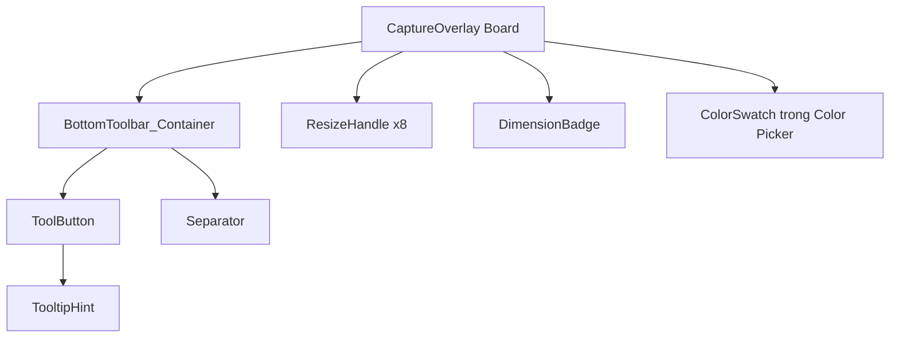

# UI/UX Mock Penpot — Common Components

> Mô tả các Master Component dùng chung trong workspace Penpot. Mỗi component được thiết kế bằng Flex Layout để tái sử dụng qua các board trạng thái.

---

## 1. Component `ToolButton`

### 1.1. Mục đích

`ToolButton` là nút vuông dùng để chọn công cụ hoặc thực hiện hành động. Nó là phần tử nhỏ nhất trong toolbar.

### 1.2. Cấu trúc layer

```text
ToolButton (Board 32×32px, Flex layout căn giữa)
├── Container (32×32px, bo góc 6px)
│   ├── Icon (18×18px, SVG vector)
│   └── ShortcutLabel (10px, nằm dưới icon — chỉ hiển thị khi tooltip/không nằm trong toolbar chính)
```

### 1.3. Variants

Penpot tạo component với 4 variants chính:

| Variant | Màu nền | Màu icon | Opacity icon | Dùng khi |
| :--- | :--- | :--- | :--- | :--- |
| `Default` | Trong suốt (`#FFFFFF`, alpha = 0) | `#FFFFFF` | `0.85` | Nút chưa được chọn, chuột chưa hover. |
| `Hover` | `#FFFFFF`, alpha = `0.12` | `#FFFFFF` | `1.00` | Chuột đang nằm trên nút. |
| `Active` | `#7C3AED`, alpha = `1.00` | `#FFFFFF` | `1.00` | Công cụ đang được kích hoạt. |
| `Disabled` | Trong suốt | `#FFFFFF` | `0.35` | Nút bị vô hiệu hóa, ví dụ Undo khi không có lịch sử. |

### 1.4. Khoảng cách và căn chỉnh

- Board ngoài: `32 × 32px`.
- Icon bên trong: `18 × 18px`, căn giữa theo cả hai chiều.
- Container căn giữa icon bằng Flex với `justify-content: center`, `align-items: center`.
- Không padding bên trong vì icon đã vừa khít vùng nút.

### 1.5. Trạng thái transition

Khi chuyển variant, không dùng animation phức tạp. Chỉ thay đổi:

- Màu nền.
- Độ mờ icon.
- Không thay đổi kích thước board để tránh layout shift.

---

## 2. Component `BottomToolbar_Container`

### 2.1. Mục đích

`BottomToolbar_Container` là vỏ bọc nền chứa toàn bộ `ToolButton`. Nó nổi sát mép dưới vùng chọn.

### 2.2. Cấu trúc layer

```text
BottomToolbar_Container (auto-width × 40px)
├── Background (nền tối, bo góc 8px, viền 1px mờ, shadow 12px blur)
├── FlexGroup_Horizontal
│   ├── Group_AnnotationTools
│   │   ├── ToolButton_Pencil
│   │   ├── ToolButton_Line
│   │   ├── ToolButton_Arrow
│   │   ├── ToolButton_Rectangle
│   │   ├── ToolButton_Circle
│   │   ├── ToolButton_Marker
│   │   ├── ToolButton_Text
│   │   └── ToolButton_Pixelate
│   ├── Separator (1×20px, màu trắng 15% opacity)
│   └── Group_ActionTools
│       ├── ToolButton_Undo
│       ├── ToolButton_Redo
│       ├── ToolButton_Copy
│       ├── ToolButton_Save
│       └── ToolButton_Cancel
```

### 2.3. Layout chi tiết

- Chiều cao cố định: `40px`.
- Chiều rộng tự động theo số lượng nút.
- Padding ngang: `8px`; padding dọc: `4px`.
- Khoảng cách giữa các nút trong cùng nhóm: `4px`.
- Khoảng cách giữa hai nhóm qua separator: `8px` tính từ mép nút cuối nhóm 1 đến separator, và `8px` từ separator đến nút đầu nhóm 2.
- Separator là hình chữ nhật đứng `1px × 20px`, căn giữa theo chiều dọc trong toolbar.

### 2.4. Góc cạnh và bóng đổ

- Bo góc `8px`.
- Viền ngoài `1px`, màu trắng `10%` opacity.
- Shadow: màu đen `40%` opacity, blur `12px`, offsetY `4px`, không offsetX.

### 2.5. Hành vi responsive

Khi vùng chọn nằm gần cạnh màn hình:

- Nếu toolbar vượt quá biên phải màn hình, dịch chuyển sang trái để vừa vặn.
- Nếu vùng chọn ở sát biên dưới màn hình, toolbar hiển thị ở mép trên vùng chọn thay vì mép dưới.
- Khoảng cách tối thiểu từ toolbar đến biên màn hình: `8px`.

---

## 3. Component `ResizeHandle`

### 3.1. Mục đích

`ResizeHandle` là điểm neo vuông nhỏ xuất hiện quanh vùng chọn khi đã hoàn tất. Dùng để bắt chuột co giãn.

### 3.2. Cấu trúc layer

```text
ResizeHandle (8×8px)
├── VisibleSquare (8×8px, fill cyan, stroke đen 1px)
└── HitTestArea (16×16px, trong suốt, nằm centered xung quanh VisibleSquare)
```

### 3.3. Kích thước

- Hình vuông hiển thị: `8 × 8px`.
- Vùng bắt chuột mở rộng: `16 × 16px`.
- Stroke ngoài: `1px` màu đen.
- Fill: màu cyan `#00E5FF` không trong suốt.

### 3.4. Vị trí 8 handle

Gọi vùng chọn là `R` với `Left = R.X`, `Top = R.Y`, `Right = R.X + R.Width`, `Bottom = R.Y + R.Height`. Tọa độ tâm của 8 handle:

| Handle | Tọa độ tâm (CenterX, CenterY) |
| :--- | :--- |
| TopLeft | `(R.Left, R.Top)` |
| TopCenter | `(R.Left + R.Width / 2, R.Top)` |
| TopRight | `(R.Right, R.Top)` |
| MiddleLeft | `(R.Left, R.Top + R.Height / 2)` |
| MiddleRight | `(R.Right, R.Top + R.Height / 2)` |
| BottomLeft | `(R.Left, R.Bottom)` |
| BottomCenter | `(R.Left + R.Width / 2, R.Bottom)` |
| BottomRight | `(R.Right, R.Bottom)` |

Mỗi handle được vẽ sao cho tâm của nó trùng với tọa độ trên. Do kích thước hiển thị là `8 × 8px`, góc trên-trái của hình vuông hiển thị sẽ lệch `-4px` so với tâm.

### 3.5. Cursor tương ứng

| Handle | Con trỏ chuột |
| :--- | :--- |
| TopLeft, BottomRight | `nwse-resize` |
| TopRight, BottomLeft | `nesw-resize` |
| TopCenter, BottomCenter | `ns-resize` |
| MiddleLeft, MiddleRight | `ew-resize` |

---

## 4. Component `DimensionBadge`

### 4.1. Mục đích

`DimensionBadge` hiển thị kích thước vùng chọn `Width × Height` hoặc `Width × Height + X + Y` khi đang kéo hoặc co giãn.

### 4.2. Cấu trúc layer

```text
DimensionBadge (auto-width × 18px)
├── Background (nền accent, bo góc 4px)
└── TextLabel (font 11px, màu trắng, weight 600)
```

### 4.3. Nội dung văn bản

- Khi đang kéo tạo vùng chọn hoặc resize: `"{Width} × {Height}"`.
- Khi đã chọn xong và cần thông tin đầy đủ (tùy chọn): `"{Width} × {Height} @ {X},{Y}"`.
- Font: `Segoe UI`, `11px`, `weight 600`.

### 4.4. Vị trí

- Mặc định đặt ở góc trên-phải của vùng chọn.
- Khoảng cách từ góc vùng chọn: `4px` về phía trên và `4px` về phía phải.
- Nếu vùng chọn nằm sát biên trên màn hình, badge chuyển xuống góc dưới-phải.
- Padding ngang: `6px`, padding dọc: `2px`.

---

## 5. Component `ColorSwatch`

### 5.1. Mục đích

`ColorSwatch` là ô màu tròn nhỏ trong popup chọn màu hoặc palette công cụ. Dùng để xem trước màu annotation đang chọn.

### 5.2. Cấu trúc layer

```text
ColorSwatch (20×20px, hình tròn)
├── FillCircle (18×18px, màu annotation)
└── OuterRing (20×20px, viền trắng 1px, hiển thị khi swatch đang active)
```

### 5.3. Variants

| Variant | Mô tả |
| :--- | :--- |
| `Default` | Hình tròn tô màu, viền mờ `1px` trắng `30%` opacity. |
| `Active` | Hình tròn tô màu, viền trắng `2px` đậm hơn, kích thước ngoài `20px`. |
| `Hover` | Tô thêm lớp trắng mờ `10%` lên trên màu gốc. |

---

## 6. Component `TooltipHint`

### 6.1. Mục đích

`TooltipHint` là nhãn nhỏ hiển thị tên công cụ và phím tắt khi hover lâu vào `ToolButton`. Không bắt buộc trong MVP nhưng nên thiết kế sẵn.

### 6.2. Cấu trúc layer

```text
TooltipHint (auto-width × 24px)
├── Background (nền đen `#000000`, opacity 0.85, bo góc 4px)
└── Text (13px, trắng)
```

### 6.3. Nội dung

Dạng `"Tên công cụ (Shortcut)"`, ví dụ `"Bút vẽ (P)"`.

---

## 7. Quan hệ giữa các component



---

## 8. Notes cho Penpot

- Mỗi component Master nên được đặt trong Board riêng với kích thước chuẩn, ví dụ `ToolButton` trong Board `32 × 32px`.
- Dùng **Variants** của Penpot để quản lý Default / Hover / Active / Disabled.
- Không gộp nhiều trạng thái vào cùng một layer; tách rõ các layer nền, icon, label.
- Icon nên là vector SVG đơn giản, không raster, để dễ export.
- `ResizeHandle` cần tách lớp `HitTestArea` trong suốt riêng với `VisibleSquare` để designer và developer cùng hiểu vùng bắt chuột.
