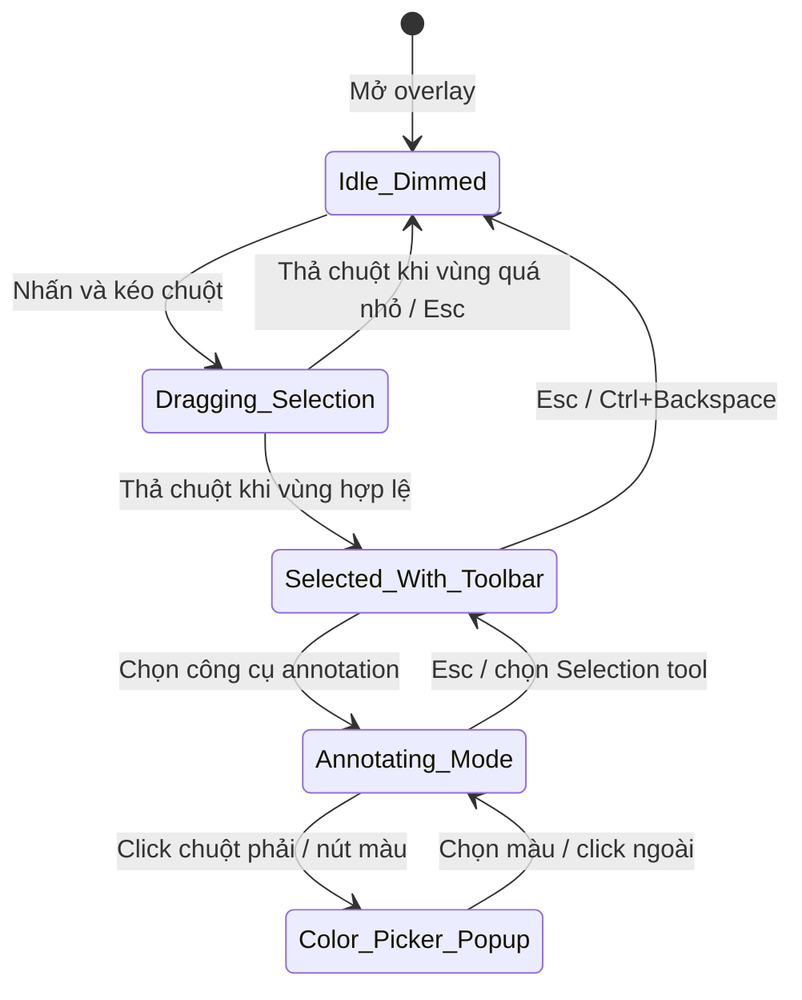

# UI/UX Mock Penpot — Capture Overlay States

> Tài liệu mô tả 5 Board trên Page `01_CaptureOverlay` để thể hiện vòng đời trạng thái của màn hình chụp. Mỗi board là một khoảnh khắc cụ thể trong tương tác người dùng.

---

## 1. Nguyên tắc thiết kế board

Mỗi Board trong Page `01_CaptureOverlay` có kích thước chuẩn `1280 × 720px` hoặc `1920 × 1080px`. Nền của mỗi board là ảnh chụp màn hình giả lập (một screenshot desktop mẫu). Trên ảnh nền đó xếp các layer theo thứ tự từ dưới lên:

```text
1. Background_Screenshot
2. Dimmed_Mask / Hole_Mask
3. Selection_Border
4. Selection_Handles
5. DimensionBadge
6. Toolbar / Annotation_Layer / Popup
7. Cursor_Indicator
```

Thứ tự z-index này đảm bảo:

- Vùng chọn luôn nằm trên lớp phủ tối.
- Handle nằm trên viền vùng chọn.
- Toolbar nằm trên handle.
- Popup nằm trên cùng.

---

## 2. Board 1: `State_01_Idle_Dimmed`

### 2.1. Tình huống

Overlay vừa mở. Chưa có vùng chọn. Toàn màn hình được phủ tối để người dùng biết đang trong chế độ chụp.

### 2.2. Layer chi tiết

| Layer | Loại | Mô tả |
| :--- | :--- | :--- |
| `Background_Screenshot` | Image | Ảnh desktop mẫu, kích thước full board. |
| `Dimmed_Mask` | Rectangle | Hình chữ nhật full board, màu `#000000`, opacity `50%`. |
| `Cursor_Crosshair` | Group / Vector | Dấu thập nhỏ ở vị trí chuột, gợi ý kéo để chọn. Minh họa tĩnh, không bắt buộc. |

### 2.3. Cách vẽ `Cursor_Crosshair`

Tạo group tên `Cursor_Crosshair` gồm 2 line hoặc 1 path:

- **Đường ngang:** dài `16px`, dày `2px`, màu trắng `#FFFFFF` opacity `1.00`, centered tại vị trí chuột.
- **Đường dọc:** dài `16px`, dày `2px`, màu trắng `#FFFFFF` opacity `1.00`, centered tại vị trí chuột.

Ví dụ vị trí chuột `(400, 300)`:

```text
Horizontal line: X = 400 - 8, Y = 300, Width = 16, Height = 2
Vertical line:   X = 400, Y = 300 - 8, Width = 2, Height = 16
```

Đặt group `Cursor_Crosshair` ở layer trên cùng của Board 1.

Lưu ý: đây chỉ là minh họa tĩnh. Cursor thực tế do Avalonia điều khiển khi chạy app.

### 2.3. Cursor

Con trỏ hệ thống chuyển thành `crosshair`.

### 2.4. Ghi chú

- Không có toolbar, không có handle.
- Lớp phủ tối che toàn bộ board.
- Board này thể hiện trạng thái `Idle` trong State Machine.

---

## 3. Board 2: `State_02_Dragging_Selection`

### 3.1. Tình huống

Người dùng đang giữ chuột trái và kéo để tạo vùng chọn. Vùng bên trong lộ ảnh nền rõ, vùng ngoài vẫn tối.

### 3.2. Layer chi tiết

| Layer | Loại | Mô tả |
| :--- | :--- | :--- |
| `Background_Screenshot` | Image | Ảnh nền full board. |
| `Dimmed_Mask` | Rectangle / Mask | Hình chữ nhật full board với một lỗ khoét hình chữ nhật tại vùng chọn. Lỗ khoét cho thấy ảnh nền bên di. |
| `Selection_Border` | Rectangle | Viền nét đứt `2px`, màu trắng, bao quanh vùng chọn. |
| `DimensionBadge` | Component | Badge hiển thị `Width × Height` ở góc trên-phải vùng chọn. |

### 3.3. Cách tạo lỗ khoét trong Penpot

Dùng một hình chữ nhật lớn che toàn board, sau đó đặt một hình chữ nhật nhỏ (vùng chọn) ở giữa và áp dụng boolean operation `Subtract` hoặc dùng layer mask. Màu của lớp phủ ngoài vẫn là `#000000` opacity `50%`. Vùng bị trừ hoàn toàn trong suốt.

### 3.4. Cursor

Con trỏ là `crosshair` khi đang kéo.

### 3.5. Ghi chú

- Chưa có handle, chưa có toolbar.
- Viền vùng chọn là nét đứt để phân biệt với trạng thái đã chọn xong.
- DimensionBadge xuất hiện ngay khi vùng chọn có kích thước > 0.

---

## 4. Board 3: `State_03_Selected_With_Toolbar`

### 4.1. Tình huống

Người dùng đã thả chuột. Vùng chọn hoàn tất. 8 handle xuất hiện. Toolbar nổi sát mép dưới vùng chọn.

### 4.2. Layer chi tiết

| Layer | Loại | Mô tả |
| :--- | :--- | :--- |
| `Background_Screenshot` | Image | Ảnh nền full board. |
| `Dimmed_Mask` | Rectangle / Mask | Lớp phủ tối với lỗ khoét vùng chọn. |
| `Selection_Border` | Rectangle | Viền liền `2px` màu trắng bao quanh vùng chọn. |
| `Selection_Handles` | Group | 8 instance của `ResizeHandle` đặt tại 8 vị trí quanh vùng chọn. |
| `DimensionBadge` | Component | Badge `Width × Height` ở góc trên-phải. |
| `BottomToolbar` | Component | Instance của `BottomToolbar_Container`, đặt sát mép dưới vùng chọn, lệch phải. |

### 4.3. Vị trí toolbar

Gọi vùng chọn là `R`. Toolbar được đặt theo công thức:

```text
Toolbar.X = R.Right - Toolbar.Width
Toolbar.Y = R.Bottom + 8px
```

Nếu `Toolbar.X < 8px` thì clamp về `8px`.
Nếu `Toolbar.Y + Toolbar.Height > ScreenHeight - 8px` thì chuyển toolbar lên phía trên:

```text
Toolbar.Y = R.Top - Toolbar.Height - 8px
```

### 4.4. Handle z-order

Handle phải nằm trên viền vùng chọn. Trong Penpot, group `Selection_Handles` đặt ở layer trên `Selection_Border`.

### 4.5. Cursor

- Khi chuột nằm trong vùng chọn: `move`.
- Khi chuột nằm trên handle: cursor tương ứng theo hướng resize (xem `12_02_CommonComponents.md`).
- Khi chuột nằm trên toolbar: `default`.

---

## 5. Board 4: `State_04_Annotating_Mode`

### 5.1. Tình huống

Người dùng đã chọn một công cụ annotation từ toolbar (ví dụ Pencil). Toolbar vẫn hiển thị. Nút công cụ đang active có nền tím. Trên vùng chọn có thể có một vài annotation mẫu.

### 5.2. Layer chi tiết

| Layer | Loại | Mô tả |
| :--- | :--- | :--- |
| `Background_Screenshot` | Image | Ảnh nền. |
| `Dimmed_Mask` | Rectangle / Mask | Lớp phủ tối với lỗ khoét. |
| `Selection_Border` | Rectangle | Viền liền vùng chọn. |
| `Selection_Handles` | Group | 8 handle vẫn hiển thị để người dùng có thể điều chỉnh vùng chọn. |
| `Annotation_Layer` | Group | Các nét vẽ mẫu: pencil, line, arrow, rectangle, circle, marker, text, pixelate. Các nét này nằm trên ảnh nền vùng chọn, dưới toolbar. |
| `DimensionBadge` | Component | Badge kích thước. |
| `BottomToolbar` | Component | Toolbar, nút công cụ đang active có variant `Active`. |

### 5.3. Annotation mẫu trong board

Trong board thiết kế, nên vẽ một vài hình mẫu minh họa:

- Một đường cong tự do màu đỏ (`Pencil`).
- Một đường thẳng màu xanh dương (`Line`).
- Một mũi tên màu vàng (`Arrow`).
- Một hình chữ nhật bo góc màu xanh lá (`Rectangle`).
- Một hình tròn màu tím (`Circle`).
- Một vùng tô mờ bán trong suốt màu vàng (`Marker`).
- Một dòng chữ màu đỏ (`Text`).
- Một vùng pixelate hình vuông nhỏ (`Pixelate`).

### 5.4. Cursor

- Trong vùng chọn, khi đang vẽ annotation: cursor tùy theo công cụ, thường là `crosshair` hoặc `default`.
- Khi hover nút công cụ: `pointer`.

---

## 6. Board 5: `State_05_Color_Picker_Popup`

### 6.1. Tình huống

Người dùng click chuột phải hoặc click nút chọn màu trên toolbar. Một popup bảng màu hiện ra gần vị trí chuột.

### 6.2. Layer chi tiết

| Layer | Loại | Mô tả |
| :--- | :--- | :--- |
| `Background_Screenshot` | Image | Ảnh nền. |
| `Dimmed_Mask` | Rectangle / Mask | Lớp phủ tối với lỗ khoét. |
| `Selection_Border` | Rectangle | Viền vùng chọn. |
| `Selection_Handles` | Group | 8 handle. |
| `BottomToolbar` | Component | Toolbar. |
| `ColorPicker_Popup` | Group | Popup chứa bảng màu và các `ColorSwatch`. |

### 6.3. Cấu trúc Color Picker Popup

```text
ColorPicker_Popup
├── Popup_Background (nền tối, bo góc 10px, shadow)
├── Header_Text ("Chọn màu" hoặc "Màu hiện tại")
├── Swatch_Grid
│   ├── Row 1: Red, Yellow, Green, Blue
│   ├── Row 2: White, Black, Purple, Orange
│   └── Row 3: Custom color preview + color wheel
└── Opacity_Slider (tùy chọn, dùng cho marker)
```

### 6.4. Vị trí popup

Popup xuất hiện cạnh vị trí kích hoạt:

```text
Popup.X = Trigger.X + 6px
Popup.Y = Trigger.Y + 6px
```

Nếu popup vượt biên phải hoặc biên dưới màn hình, flip ngược lại:

```text
Popup.X = Trigger.X - Popup.Width - 6px
Popup.Y = Trigger.Y - Popup.Height - 6px
```

### 6.5. Cursor

- Trên swatch: `pointer`.
- Trên opacity slider: `ew-resize`.

---

## 7. Sơ đồ chuyển đổi giữa các board



---

## 8. Notes cho Penpot

- Nên đặt 5 board cạnh nhau theo hàng ngang hoặc hàng dọc để dễ so sánh.
- Mỗi board nên có tên trạng thái ở góc trên-trái để reviewer dễ nhận diện.
- Dùng Instance của `BottomToolbar_Container` và `ResizeHandle` để đảm bảo kích thước đồng nhất.
- Annotation mẫu trong Board 4 nên là vector hoặc path đơn giản, không cần quá chi tiết.
- Board 5 có thể tách thành 2 nhỏ: một popup dạng palette đơn giản và một popup dạng color wheel nếu muốn thể hiện cả hai phương án.
