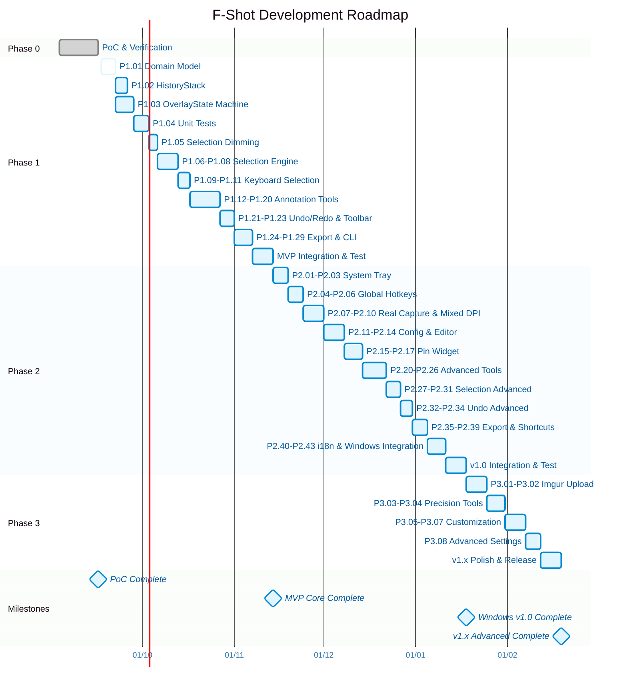

# F-Shot Lộ trình Gantt Chart

> Biểu đồ Gantt tổng quan cho 4 Phase của F-Shot.
> Ngày bắt đầu dự án giả định: 03/09/2026.

---

## Ghi chú

- **Phase 0**: 03/09/2026 → 16/09/2026 — **đã hoàn thành**.
- **Phase 1**: 17/09/2026 → 10/10/2026 — đang bắt đầu với P1.01.
- **Phase 2**: 11/10/2026 → 07/11/2026 — phụ thuộc hoàn thành Phase 1.
- **Phase 3**: 08/11/2026 → 28/11/2026 — phụ thuộc hoàn thành Phase 2.

Mỗi task trong Gantt tương ứng với các mục trong `03_00_Progres_Overview.md`.
