# F-Shot Lộ trình Gantt Chart

> Biểu đồ Gantt trực quan hóa từng task `P` trong `03_00_Progres_Overview.md`.
> Mỗi **section** là một tuần lịch; mỗi **thanh** là một task `P` duy nhất.
> Các task được xếp theo đúng thứ tự từng ngày.
> Ngày bắt đầu dự án: **03/09/2026**. Ngày kết thúc dự kiến theo tiến độ nối tiếp 1 task/ngày: **01/12/2026**.
> Ngày hiện tại: **12/09/2026**. Trạng thái hiện tại: **P1.01 đang thực hiện**.

```mermaid
gantt
    title F-Shot Development Roadmap — Mỗi P là một thanh, sắp xếp theo ngày
    dateFormat YYYY-MM-DD
    axisFormat %d/%m
    tickInterval 1week
    todayMarker stroke:#ff0000,stroke-width:3px,opacity:0.7

    section Tuần 1
    P0.1 Tạo Solution FShot chuẩn 4 projects + 1 test project :done, p01, 2026-09-03, 1d
    P0.2 Khai báo Primitive Types Point Rect ColorRgba :done, p02, 2026-09-04, 1d
    P0.3 Triển khai ScreenEnumeration :done, p03, 2026-09-05, 1d
    P0.4 Triển khai CaptureAdapterStub :done, p04, 2026-09-06, 1d
    P0.5 Xây dựng SkiaCanvas control trong Avalonia :done, p05, 2026-09-07, 1d
    P0.6 Mở cửa sổ Avalonia borderless topmost phủ Virtual Screen :done, p06, 2026-09-08, 1d
    P0.7 Tích hợp chuột kéo vùng chọn Selection :done, p07, 2026-09-09, 1d

    section Tuần 2
    P0.8 Đo hiệu năng render canvas từ 60 FPS :done, p08, 2026-09-10, 1d
    PoC Complete :milestone, m0, 2026-09-16, 0d

    section Tuần 3
    P1.01 Domain model đầy đủ Annotation DU CaptureMode ExportTarget :active, p101, 2026-09-17, 1d
    P1.02 Immutable HistoryStack phục vụ hoàn tác :p102, 2026-09-18, 1d
    P1.03 F# Overlay State Machine Idle Selecting Selected Annotating :p103, 2026-09-19, 1d
    P1.04 Unit tests Geometry Nudge Resize Clamp và History :p104, 2026-09-20, 1d
    P1.05 Lớp phủ tối mờ Skia ngoài vùng chọn :p105, 2026-09-21, 1d
    P1.06 Kéo bounding box tự do :p106, 2026-09-22, 1d
    P1.07 8 điểm neo co giãn vùng chọn :p107, 2026-09-23, 1d

    section Tuần 4
    P1.08 Kéo rê di chuyển toàn bộ vùng chọn :p108, 2026-09-24, 1d
    P1.09 Dịch chuyển vùng chọn 1px bằng phím mũi tên :p109, 2026-09-25, 1d
    P1.10 Co giãn 1px bằng Shift + Arrow :p110, 2026-09-26, 1d
    P1.11 Phím tắt Esc hoặc Ctrl+Backspace hủy vùng chọn hoặc thoát app :p111, 2026-09-27, 1d
    P1.12 Bút vẽ tự do Pencil làm mịn Bézier :p112, 2026-09-28, 1d
    P1.13 Vẽ đường thẳng Line :p113, 2026-09-29, 1d
    P1.14 Vẽ mũi tên Arrow có chóp định hướng :p114, 2026-09-30, 1d

    section Tuần 5
    P1.15 Vẽ hình chữ nhật Rectangle hỗ trợ bo góc :p115, 2026-10-01, 1d
    P1.16 Vẽ hình tròn elip Circle giữ Ctrl khóa tỉ lệ 1:1 :p116, 2026-10-02, 1d
    P1.17 Bút nhớ Marker bán trong suốt Alpha Blend :p117, 2026-10-03, 1d
    P1.18 Chèn văn bản Text gõ qua Avalonia TextBox :p118, 2026-10-04, 1d
    P1.19 Che mờ Pixelate xử lý trực tiếp trên mảng byte :p119, 2026-10-05, 1d
    P1.20 Phím tắt chuyển nhanh công cụ P D A S R C M T B I :p120, 2026-10-06, 1d
    P1.21 Hoàn tác Undo Ctrl+Z :p121, 2026-10-07, 1d

    section Tuần 6
    P1.22 Làm lại Redo Ctrl+Shift+Z hoặc Ctrl+Y :p122, 2026-10-08, 1d
    P1.23 Toolbar tối giản nằm sát dưới vùng chọn :p123, 2026-10-09, 1d
    P1.24 Lưu file ổ cứng Ctrl+S kèm tên file ngày tháng :p124, 2026-10-10, 1d
    P1.25 Hộp thoại Save As Fallback :p125, 2026-10-11, 1d
    P1.26 Sao chép nhanh vào Clipboard dạng PNG :p126, 2026-10-12, 1d
    P1.27 Parser lệnh dòng lệnh bằng Argu :p127, 2026-10-13, 1d
    P1.28 Cấu hình độ trễ chụp -d hoặc --delay :p128, 2026-10-14, 1d

    section Tuần 7
    P1.29 Lưu trữ và nạp cấu hình cơ bản từ JSON :p129, 2026-10-15, 1d
    MVP Core Complete :milestone, m1, 2026-10-15, 0d
    P2.01 Biểu tượng tray với menu ngữ cảnh :p201, 2026-10-16, 1d
    P2.02 Single-instance và khởi động cùng Windows :p202, 2026-10-17, 1d
    P2.03 Thoát graceful, thông báo thành công hoặc hủy :p203, 2026-10-18, 1d
    P2.04 Đăng ký phím nóng toàn hệ thống Win+Shift+X :p204, 2026-10-19, 1d

    section Tuần 8
    P2.05 Tích hợp PrintScreen và xử lý xung đột Snipping Tool :p205, 2026-10-20, 1d
    P2.06 Cấu hình phím tắt toàn cục :p206, 2026-10-21, 1d
    P2.07 Triển khai Windows.Graphics.Capture mixed-DPI :p207, 2026-10-22, 1d
    P2.08 Chụp một màn hình cụ thể hoặc có con trỏ qua WinRT :p208, 2026-10-23, 1d
    P2.09 Fallback BitBlt khi WinRT không khả dụng :p209, 2026-10-24, 1d
    P2.10 Xử lý đúng Mixed DPI và Per-Monitor V2 DPI Awareness :p210, 2026-10-25, 1d
    P2.11 Đọc ghi cấu hình JSON tại APPDATA FShot config.json :p211, 2026-10-26, 1d

    section Tuần 9
    P2.12 Migrate hoặc đọc cấu hình cũ từ flameshot.ini :p212, 2026-10-27, 1d
    P2.13 Cửa sổ cài đặt Config Editor :p213, 2026-10-28, 1d
    P2.14 Trình chỉnh sửa mẫu tên file strftime preview :p214, 2026-10-29, 1d
    P2.15 Cửa sổ ghim ảnh Topmost không viền :p215, 2026-10-30, 1d
    P2.16 Di chuyển thu phóng xoay ảnh ghim :p216, 2026-10-31, 1d
    P2.17 Menu ngữ cảnh cửa sổ ghim :p217, 2026-11-01, 1d
    P2.20 Công cụ đảo ngược màu Invert :p220, 2026-11-02, 1d

    section Tuần 10
    P2.21 Bong bóng đếm số Circle Counter :p221, 2026-11-03, 1d
    P2.22 Ràng buộc góc 45 90 khi vẽ line arrow marker :p222, 2026-11-04, 1d
    P2.23 Giữ tỉ lệ 1:1 khi vẽ rectangle circle bằng Ctrl :p223, 2026-11-05, 1d
    P2.24 Nhập số để đặt chính xác kích thước công cụ :p224, 2026-11-06, 1d
    P2.25 Lăn chuột để tăng giảm độ dày nét vẽ :p225, 2026-11-07, 1d
    P2.26 Chọn di chuyển hoặc sửa chú thích cũ :p226, 2026-11-08, 1d
    P2.27 Co giãn đối xứng 2px bằng Ctrl+Shift+Arrow :p227, 2026-11-09, 1d

    section Tuần 11
    P2.28 Ngăn vùng chọn thu nhỏ quá mức :p228, 2026-11-10, 1d
    P2.29 Chọn toàn bộ màn hình chụp bằng Ctrl+A :p229, 2026-11-11, 1d
    P2.30 Hiển thị tọa độ và kích thước vùng chọn WxH+X+Y :p230, 2026-11-12, 1d
    P2.31 Co giãn đối xứng điểm đối diện khi giữ Shift :p231, 2026-11-13, 1d
    P2.32 Cấu hình giới hạn số bước lưu lịch sử :p232, 2026-11-14, 1d
    P2.33 Lưu toàn bộ danh sách chú thích vào mỗi snapshot :p233, 2026-11-15, 1d
    P2.34 Hoàn tác việc di chuyển lớp lên xuống :p234, 2026-11-16, 1d

    section Tuần 12
    P2.35 Double-click vùng chọn để copy :p235, 2026-11-17, 1d
    P2.36 Xuất byte PNG thô ra stdout và in geometry ra stdout :p236, 2026-11-18, 1d
    P2.37 Mở ảnh bằng ứng dụng mặc định và chọn định dạng lưu :p237, 2026-11-19, 1d
    P2.38 Thông báo Windows Toast khi lưu copy thành công :p238, 2026-11-20, 1d
    P2.39 Hỗ trợ đầy đủ các phím tắt còn lại :p239, 2026-11-21, 1d
    Windows v1.0 Complete :milestone, m2, 2026-11-21, 0d
    P2.42 Console output cho các lệnh CLI :p242, 2026-11-22, 1d

    section Tuần 13
    P2.43 Import export reset cấu hình và hot-reload :p243, 2026-11-23, 1d
    P3.01 Upload ảnh ẩn danh lên Imgur :p301, 2026-11-24, 1d
    P3.02 Lịch sử upload và API key Imgur :p302, 2026-11-25, 1d
    P3.03 Snap-to-grid và pixel-perfect selection :p303, 2026-11-26, 1d
    P3.04 Kính lúp và công cụ lấy màu từ màn hình :p304, 2026-11-27, 1d
    P3.05 Bảng màu tùy chỉnh thêm xóa sắp xếp màu :p305, 2026-11-28, 1d
    P3.06 Tùy chỉnh thanh công cụ ẩn hiện nút sắp xếp công cụ :p306, 2026-11-29, 1d
    P3.07 Ngôn ngữ giao diện font mặc định màu accent độ mờ ngoài vùng chọn :p307, 2026-11-30, 1d
    P3.08 Tùy chọn nâng cao kiểm tra cập nhật thông báo nhiều instance copy JPG tự động đóng daemon :p308, 2026-12-01, 1d
    v1.x Advanced Complete :milestone, m3, 2026-12-01, 0d
```

---

## Chú thích trạng thái

| Ký hiệu trong Gantt | Ý nghĩa |
|---------------------|---------|
| `done` (xanh dương đậm) | Đã hoàn thành |
| `active` (xanh dương nhạt) | Đang thực hiện |
| Không đánh dấu (trắng/xám) | Chưa bắt đầu |
| `milestone` (hình thoi) | Mốc hoàn thành Phase |
| Đường đỏ dọc | Ngày hiện tại (**12/09/2026**), hiện tại nằm trong Tuần 2 |

---

## Ánh xạ với `03_00_Progres_Overview.md`

| Tuần | Các task P trong Progress |
|------|---------------------------|
| Tuần 1 | P0.1 – P0.7 |
| Tuần 2 | P0.8, PoC Complete |
| Tuần 3 | P1.01 – P1.07 |
| Tuần 4 | P1.08 – P1.14 |
| Tuần 5 | P1.15 – P1.21 |
| Tuần 6 | P1.22 – P1.28 |
| Tuần 7 | P1.29, MVP Core Complete, P2.01 – P2.04 |
| Tuần 8 | P2.05 – P2.11 |
| Tuần 9 | P2.12 – P2.20 |
| Tuần 10 | P2.21 – P2.27 |
| Tuần 11 | P2.28 – P2.34 |
| Tuần 12 | P2.35 – P2.39, Windows v1.0 Complete, P2.42 |
| Tuần 13 | P2.43, P3.01 – P3.08, v1.x Advanced Complete |

---

## Bảng tổng hợp thời gian

| Phase | Ngày bắt đầu | Ngày kết thúc | Số tuần | Trạng thái |
|-------|-------------|--------------|---------|------------|
| Phase 0: PoC | 03/09/2026 | 16/09/2026 | 2 | ✅ Hoàn thành |
| Phase 1: MVP Core | 17/09/2026 | 15/10/2026 | 4 | 🔄 Đang thực hiện (P1.01 active) |
| Phase 2: Windows v1.0 | 16/10/2026 | 21/11/2026 | 5 | ⏳ Chờ Phase 1 |
| Phase 3: Advanced | 24/11/2026 | 01/12/2026 | 1.2 | ⏳ Chờ Phase 2 |
| **Tổng cộng** | **03/09/2026** | **01/12/2026** | **13.2** | — |

---

## Ghi chú quan trọng

1. **Mỗi thanh là một task `P` duy nhất**, lấy tên rút gọn từ `03_00_Progres_Overview.md` để tránh ký tự đặc biệt gây lỗi Mermaid.
2. **Các task xếp nối tiếp theo ngày**: task sau luôn bắt đầu ngày hôm sau task trước.
3. **Mỗi task tính 1 ngày** để Gantt giãn đều theo ngày và dễ đọc; thời lượng thực tế có thể dài hơn.
4. **P2.18 / P2.19 / P2.40 / P2.41** hiện chưa xuất hiện trong `03_00_Progres_Overview.md` (danh sách chi tiết), nên Gantt cũng chưa vẽ.
5. **Đường đỏ** đánh dấu ngày hiện tại (**12/09/2026**); P1.01 được đánh dấu `active` để thể hiện trạng thái thực tế đã bắt đầu thiết kế sớm.
